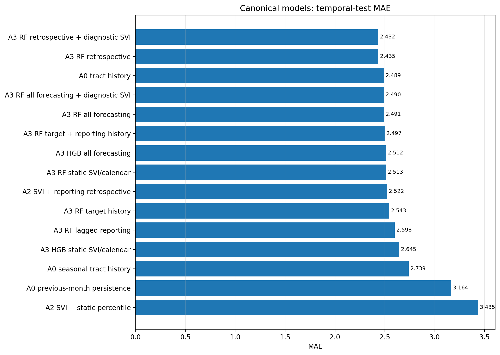
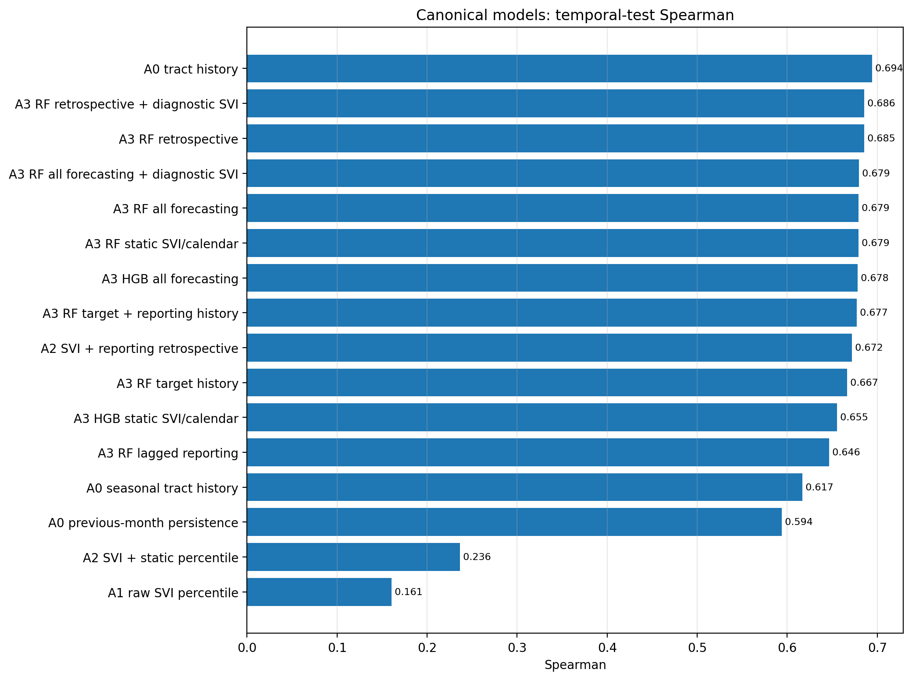
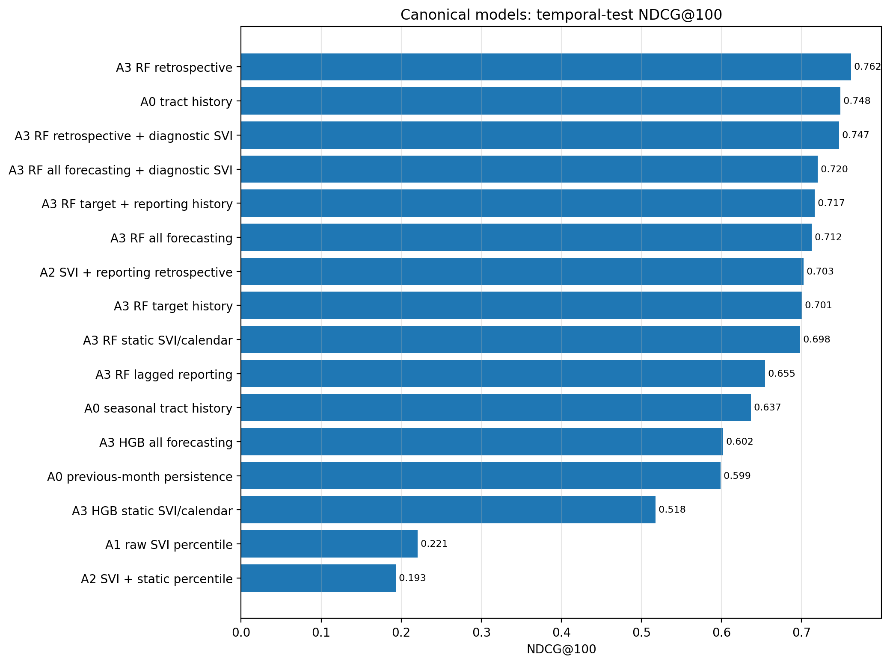
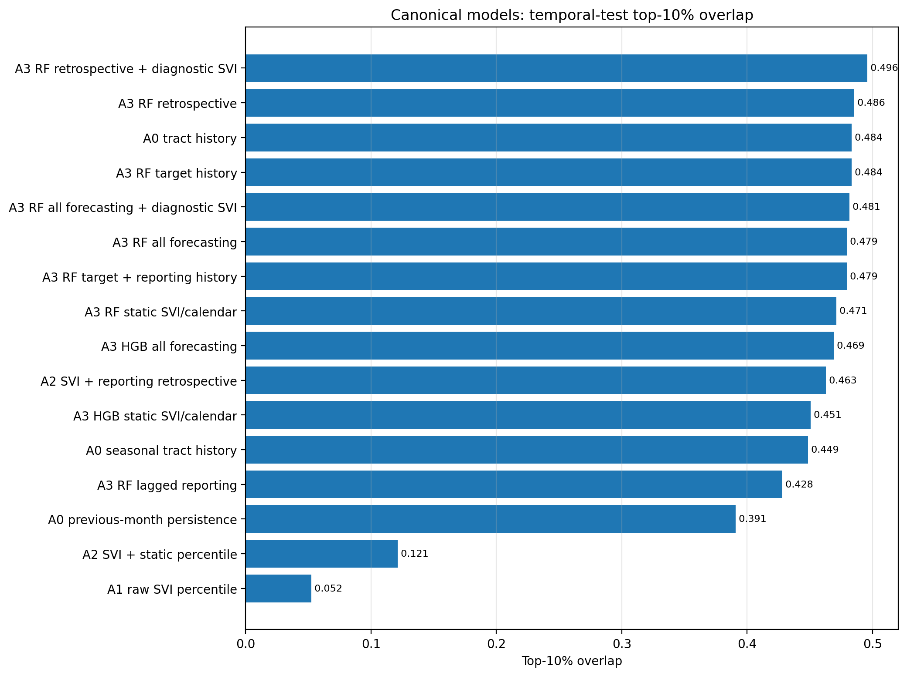
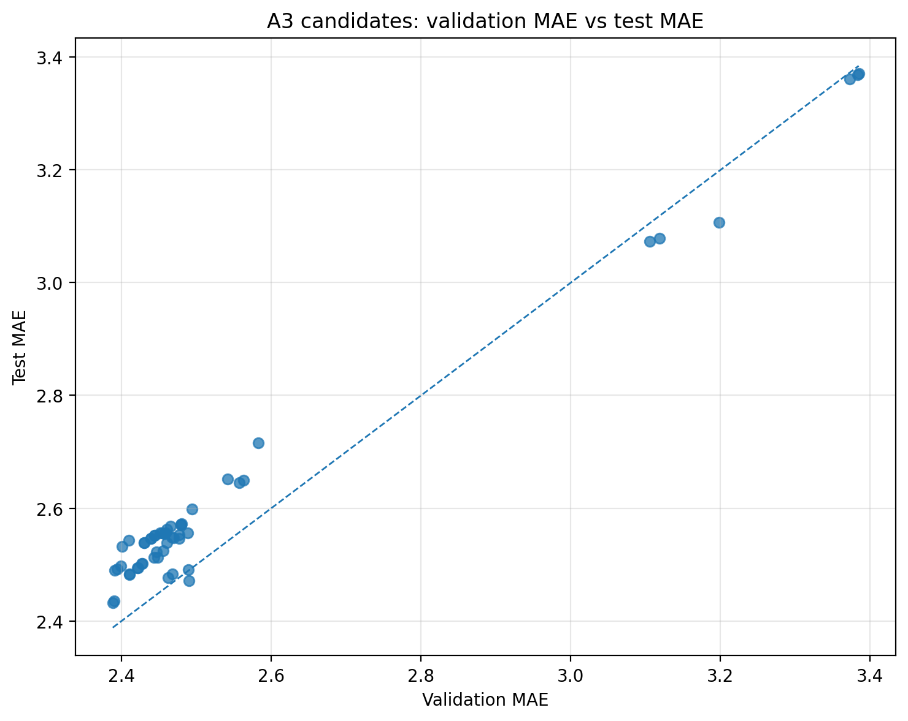
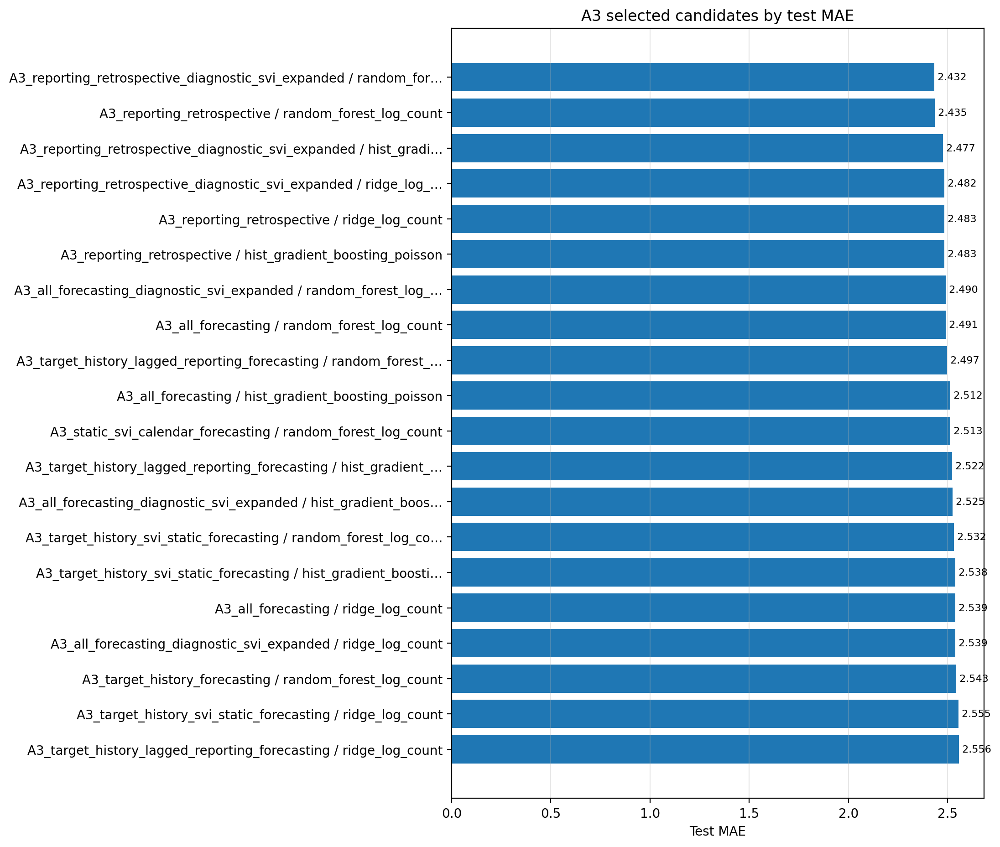

# A0/A1/A2/A3 Baseline Comparison — Montréal 311 Water/Drainage v0

Generated at: `2026-06-10T13:22:02.504915+00:00`

Test split: `temporal_test`

Validation split used by A3 selection: `temporal_validation`

## Purpose

This report compares already-produced A0, A1, A2, and A3 baseline metrics. It does not retrain models. Its goal is to establish the non-graph benchmark floor before GraphSAGE/HGNN.

## Prediction-setting guardrails

- `forecasting_v0`: static/calendar/train-derived information only.
- `one_step_observed_history_v0`: observed-history baseline using prior observations.
- `rolling_observed_history_v0`: A3 lag/rolling features; valid for rolling monthly forecasting, not for forecasting the whole future horizon from the train endpoint.
- `retrospective_explanatory_v0`: same-month reporting controls; not a forecasting setting.

## Headline interpretation

- A3 RF all-forecasting nearly reaches A0 tract-history on count error (MAE 2.4914 vs 2.4892), but A0 remains stronger on ranking (Spearman 0.6942 vs 0.6791).
- The diagnostic SVI-expanded A3 model is essentially tied with the primary A3 model, so rank/class SVI should remain a robustness diagnostic rather than the main claim.
- The static SVI/calendar/spatial RF baseline is surprisingly strong, which means the tabular baseline already captures substantial static spatial structure.
- A3 retrospective improves count error by using same-month non-water 311 reporting, but it is explanatory/retrospective and should not be mixed with forecasting claims.

## Canonical temporal-test comparison

```text
                                 label source_stage           prediction_setting                   model_family                                   feature_set_name                                                                                             model_name                                                    role      MAE     RMSE  Poisson deviance  Spearman  NDCG@100  Top-10% overlap
                 A1 raw SVI percentile           A1 static_svi_direct_ranking_v0             static_svi_ranking                                     svi_percentile                                                                  A1_svi_direct_ranking__svi_percentile                          raw primary static SVI ranking      NaN      NaN               NaN  0.160639  0.220560         0.052411
             A0 seasonal tract history           A0               forecasting_v0                 naive_temporal              tract_month_of_year_train_target_mean                                                                    A0_4_tract_month_of_year_train_mean                     seasonal naive forecasting baseline 2.739026 3.914971          3.333048  0.616683  0.636779         0.448560
                      A0 tract history           A0               forecasting_v0                 naive_temporal                            tract_train_target_mean                                                                                  A0_3_tract_train_mean                       strong naive forecasting baseline 2.489209 3.462372          2.143367  0.694235  0.748363         0.483539
            A2 SVI + static percentile           A2               forecasting_v0                ridge_log_count                                 A2_svi_plus_static                                                                     A2_svi_plus_static__svi_percentile                      calibrated primary SVI forecasting 3.434751 4.936054          4.952062  0.236370  0.193140         0.121399
            A3 HGB static SVI/calendar           A3               forecasting_v0 hist_gradient_boosting_poisson                 A3_static_svi_calendar_forecasting                     hist_gradient_boosting_poisson__A3_static_svi_calendar_forecasting__hgb_poisson_01             static/spatial Poisson boosting forecasting 2.644897 3.880837          2.540130  0.655237  0.517682         0.450617
             A3 RF static SVI/calendar           A3               forecasting_v0        random_forest_log_count                 A3_static_svi_calendar_forecasting                 random_forest_log_count__A3_static_svi_calendar_forecasting__rf_log_count_conservative                    static/spatial nonlinear forecasting 2.512990 3.708395          2.445588  0.678924  0.698250         0.471193
         A0 previous-month persistence           A0 one_step_observed_history_v0                 naive_temporal           lag1_observed_target_with_train_fallback                                                                        A0_5_previous_month_persistence                      one-step observed-history baseline 3.163786 4.542031         11.224499  0.593867  0.598551         0.390947
                A3 HGB all forecasting           A3  rolling_observed_history_v0 hist_gradient_boosting_poisson                                 A3_all_forecasting                                     hist_gradient_boosting_poisson__A3_all_forecasting__hgb_poisson_01                            main HGB A3 rolling forecast 2.512332 3.652684          2.274466  0.677990  0.602010         0.469136
                 A3 RF all forecasting           A3  rolling_observed_history_v0        random_forest_log_count                                 A3_all_forecasting                                 random_forest_log_count__A3_all_forecasting__rf_log_count_conservative                        main primary A3 rolling forecast 2.491364 3.650719          2.432000  0.679111  0.712395         0.479424
A3 RF all forecasting + diagnostic SVI           A3  rolling_observed_history_v0        random_forest_log_count         A3_all_forecasting_diagnostic_svi_expanded         random_forest_log_count__A3_all_forecasting_diagnostic_svi_expanded__rf_log_count_conservative             diagnostic SVI-expanded A3 rolling forecast 2.489811 3.650028          2.431457  0.679431  0.720317         0.481481
                A3 RF lagged reporting           A3  rolling_observed_history_v0        random_forest_log_count                    A3_lagged_reporting_forecasting                    random_forest_log_count__A3_lagged_reporting_forecasting__rf_log_count_conservative             lagged reporting nonlinear rolling forecast 2.598438 3.786829          2.515067  0.646495  0.654588         0.427984
      A3 RF target + reporting history           A3  rolling_observed_history_v0        random_forest_log_count     A3_target_history_lagged_reporting_forecasting     random_forest_log_count__A3_target_history_lagged_reporting_forecasting__rf_log_count_conservative target and reporting history nonlinear rolling forecast 2.497302 3.660158          2.450413  0.677004  0.716543         0.479424
                  A3 RF target history           A3  rolling_observed_history_v0        random_forest_log_count                      A3_target_history_forecasting                      random_forest_log_count__A3_target_history_forecasting__rf_log_count_conservative               target-history nonlinear rolling forecast 2.542770 3.735042          2.582136  0.666642  0.700517         0.483539
      A2 SVI + reporting retrospective           A2 retrospective_explanatory_v0                ridge_log_count                A2_svi_plus_reporting_retrospective                                                    A2_svi_plus_reporting_retrospective__svi_percentile                    calibrated primary SVI retrospective 2.522434 3.663199          2.522685  0.671736  0.702508         0.462963
                   A3 RF retrospective           A3 retrospective_explanatory_v0        random_forest_log_count                         A3_reporting_retrospective                         random_forest_log_count__A3_reporting_retrospective__rf_log_count_conservative                           main primary A3 retrospective 2.435450 3.566398          2.353485  0.685485  0.761734         0.485597
  A3 RF retrospective + diagnostic SVI           A3 retrospective_explanatory_v0        random_forest_log_count A3_reporting_retrospective_diagnostic_svi_expanded random_forest_log_count__A3_reporting_retrospective_diagnostic_svi_expanded__rf_log_count_conservative                diagnostic SVI-expanded A3 retrospective 2.431769 3.560109          2.343909  0.685681  0.747050         0.495885
```

## Visual summaries

### Canonical Test Mae



### Canonical Test Spearman



### Canonical Test Ndcg At 100



### Canonical Test Top10 Overlap



### A3 Validation Vs Test Mae



### A3 Selected Test Mae By Feature Set Family



## Best canonical model by metric

| Metric | Best canonical model |
|---|---|
| MAE | `A3 RF retrospective + diagnostic SVI` |
| RMSE | `A0 tract history` |
| Poisson deviance | `A0 tract history` |
| Spearman | `A0 tract history` |
| NDCG@100 | `A3 RF retrospective` |
| Top-10% overlap | `A3 RF retrospective + diagnostic SVI` |

## A3 validation-selected candidates

A3 candidate selection uses validation MAE. Test metrics are reported after selection.

```text
                                                                                            model_name                   model_family                                   feature_set_name           prediction_setting         hyperparameter_id  validation_mae  validation_spearman  validation_top_10pct_overlap_rate  test_mae  test_spearman  selected_overall_strict_forecasting  selected_overall_retrospective                                         selection_rule
                                        ridge_log_count__A3_static_svi_calendar_forecasting__alpha_0.1                ridge_log_count                 A3_static_svi_calendar_forecasting               forecasting_v0                 alpha_0.1        3.373057             0.454557                           0.307870  3.361320       0.360109                                False                           False min_validation_mae_within_feature_set_and_model_family
                    hist_gradient_boosting_poisson__A3_static_svi_calendar_forecasting__hgb_poisson_01 hist_gradient_boosting_poisson                 A3_static_svi_calendar_forecasting               forecasting_v0            hgb_poisson_01        2.557290             0.735743                           0.532407  2.644897       0.655237                                False                           False min_validation_mae_within_feature_set_and_model_family
                random_forest_log_count__A3_static_svi_calendar_forecasting__rf_log_count_conservative        random_forest_log_count                 A3_static_svi_calendar_forecasting               forecasting_v0 rf_log_count_conservative        2.443337             0.740313                           0.553241  2.512990       0.678924                                False                           False min_validation_mae_within_feature_set_and_model_family
                                             ridge_log_count__A3_target_history_forecasting__alpha_0.1                ridge_log_count                      A3_target_history_forecasting  rolling_observed_history_v0                 alpha_0.1        2.478888             0.745813                           0.550926  2.570638       0.676583                                False                           False min_validation_mae_within_feature_set_and_model_family
                         hist_gradient_boosting_poisson__A3_target_history_forecasting__hgb_poisson_01 hist_gradient_boosting_poisson                      A3_target_history_forecasting  rolling_observed_history_v0            hgb_poisson_01        2.453788             0.741672                           0.560185  2.555987       0.667215                                False                           False min_validation_mae_within_feature_set_and_model_family
                     random_forest_log_count__A3_target_history_forecasting__rf_log_count_conservative        random_forest_log_count                      A3_target_history_forecasting  rolling_observed_history_v0 rf_log_count_conservative        2.409560             0.738268                           0.553241  2.542770       0.666642                                False                           False min_validation_mae_within_feature_set_and_model_family
                                  ridge_log_count__A3_target_history_svi_static_forecasting__alpha_0.1                ridge_log_count           A3_target_history_svi_static_forecasting  rolling_observed_history_v0                 alpha_0.1        2.457150             0.747047                           0.557870  2.554512       0.678941                                False                           False min_validation_mae_within_feature_set_and_model_family
              hist_gradient_boosting_poisson__A3_target_history_svi_static_forecasting__hgb_poisson_01 hist_gradient_boosting_poisson           A3_target_history_svi_static_forecasting  rolling_observed_history_v0            hgb_poisson_01        2.460581             0.743649                           0.555556  2.538485       0.672686                                False                           False min_validation_mae_within_feature_set_and_model_family
          random_forest_log_count__A3_target_history_svi_static_forecasting__rf_log_count_conservative        random_forest_log_count           A3_target_history_svi_static_forecasting  rolling_observed_history_v0 rf_log_count_conservative        2.400525             0.740409                           0.562500  2.532474       0.670805                                False                           False min_validation_mae_within_feature_set_and_model_family
                                           ridge_log_count__A3_lagged_reporting_forecasting__alpha_0.1                ridge_log_count                    A3_lagged_reporting_forecasting  rolling_observed_history_v0                 alpha_0.1        3.105696             0.742143                           0.560185  3.073577       0.676840                                False                           False min_validation_mae_within_feature_set_and_model_family
                       hist_gradient_boosting_poisson__A3_lagged_reporting_forecasting__hgb_poisson_02 hist_gradient_boosting_poisson                    A3_lagged_reporting_forecasting  rolling_observed_history_v0            hgb_poisson_02        2.541229             0.724680                           0.525463  2.652124       0.645108                                False                           False min_validation_mae_within_feature_set_and_model_family
                   random_forest_log_count__A3_lagged_reporting_forecasting__rf_log_count_conservative        random_forest_log_count                    A3_lagged_reporting_forecasting  rolling_observed_history_v0 rf_log_count_conservative        2.493579             0.727507                           0.532407  2.598438       0.646495                                False                           False min_validation_mae_within_feature_set_and_model_family
                            ridge_log_count__A3_target_history_lagged_reporting_forecasting__alpha_0.1                ridge_log_count     A3_target_history_lagged_reporting_forecasting  rolling_observed_history_v0                 alpha_0.1        2.451168             0.747173                           0.560185  2.555894       0.677449                                False                           False min_validation_mae_within_feature_set_and_model_family
        hist_gradient_boosting_poisson__A3_target_history_lagged_reporting_forecasting__hgb_poisson_01 hist_gradient_boosting_poisson     A3_target_history_lagged_reporting_forecasting  rolling_observed_history_v0            hgb_poisson_01        2.446212             0.742161                           0.555556  2.522311       0.673158                                False                           False min_validation_mae_within_feature_set_and_model_family
    random_forest_log_count__A3_target_history_lagged_reporting_forecasting__rf_log_count_conservative        random_forest_log_count     A3_target_history_lagged_reporting_forecasting  rolling_observed_history_v0 rf_log_count_conservative        2.398850             0.743380                           0.571759  2.497302       0.677004                                False                           False min_validation_mae_within_feature_set_and_model_family
                                                        ridge_log_count__A3_all_forecasting__alpha_0.1                ridge_log_count                                 A3_all_forecasting  rolling_observed_history_v0                 alpha_0.1        2.429762             0.748467                           0.562500  2.538869       0.679863                                False                           False min_validation_mae_within_feature_set_and_model_family
                                    hist_gradient_boosting_poisson__A3_all_forecasting__hgb_poisson_01 hist_gradient_boosting_poisson                                 A3_all_forecasting  rolling_observed_history_v0            hgb_poisson_01        2.448275             0.747882                           0.560185  2.512332       0.677990                                False                           False min_validation_mae_within_feature_set_and_model_family
                                random_forest_log_count__A3_all_forecasting__rf_log_count_conservative        random_forest_log_count                                 A3_all_forecasting  rolling_observed_history_v0 rf_log_count_conservative        2.394284             0.744328                           0.564815  2.491364       0.679111                                False                           False min_validation_mae_within_feature_set_and_model_family
                                ridge_log_count__A3_all_forecasting_diagnostic_svi_expanded__alpha_0.1                ridge_log_count         A3_all_forecasting_diagnostic_svi_expanded  rolling_observed_history_v0                 alpha_0.1        2.429747             0.748447                           0.562500  2.538988       0.679838                                False                           False min_validation_mae_within_feature_set_and_model_family
            hist_gradient_boosting_poisson__A3_all_forecasting_diagnostic_svi_expanded__hgb_poisson_01 hist_gradient_boosting_poisson         A3_all_forecasting_diagnostic_svi_expanded  rolling_observed_history_v0            hgb_poisson_01        2.455126             0.746957                           0.562500  2.524548       0.675978                                False                           False min_validation_mae_within_feature_set_and_model_family
        random_forest_log_count__A3_all_forecasting_diagnostic_svi_expanded__rf_log_count_conservative        random_forest_log_count         A3_all_forecasting_diagnostic_svi_expanded  rolling_observed_history_v0 rf_log_count_conservative        2.390825             0.744873                           0.567130  2.489811       0.679431                                 True                           False min_validation_mae_within_feature_set_and_model_family
                                                ridge_log_count__A3_reporting_retrospective__alpha_0.1                ridge_log_count                         A3_reporting_retrospective retrospective_explanatory_v0                 alpha_0.1        2.410568             0.752801                           0.569444  2.482717       0.691882                                False                           False min_validation_mae_within_feature_set_and_model_family
                            hist_gradient_boosting_poisson__A3_reporting_retrospective__hgb_poisson_01 hist_gradient_boosting_poisson                         A3_reporting_retrospective retrospective_explanatory_v0            hgb_poisson_01        2.467810             0.744927                           0.548611  2.482897       0.680876                                False                           False min_validation_mae_within_feature_set_and_model_family
                        random_forest_log_count__A3_reporting_retrospective__rf_log_count_conservative        random_forest_log_count                         A3_reporting_retrospective retrospective_explanatory_v0 rf_log_count_conservative        2.389727             0.746143                           0.571759  2.435450       0.685485                                False                           False min_validation_mae_within_feature_set_and_model_family
                        ridge_log_count__A3_reporting_retrospective_diagnostic_svi_expanded__alpha_0.1                ridge_log_count A3_reporting_retrospective_diagnostic_svi_expanded retrospective_explanatory_v0                 alpha_0.1        2.410175             0.752768                           0.571759  2.482393       0.691998                                False                           False min_validation_mae_within_feature_set_and_model_family
    hist_gradient_boosting_poisson__A3_reporting_retrospective_diagnostic_svi_expanded__hgb_poisson_01 hist_gradient_boosting_poisson A3_reporting_retrospective_diagnostic_svi_expanded retrospective_explanatory_v0            hgb_poisson_01        2.462352             0.747985                           0.550926  2.476690       0.682617                                False                           False min_validation_mae_within_feature_set_and_model_family
random_forest_log_count__A3_reporting_retrospective_diagnostic_svi_expanded__rf_log_count_conservative        random_forest_log_count A3_reporting_retrospective_diagnostic_svi_expanded retrospective_explanatory_v0 rf_log_count_conservative        2.387977             0.747199                           0.571759  2.431769       0.685681                                False                            True min_validation_mae_within_feature_set_and_model_family
```

## Test leaderboard preview

```text
leaderboard_metric_label  rank source_stage           prediction_setting                   model_family                                   feature_set_name                                                                                             model_name  count_prediction__mae  tract_month_ranking__spearman_corr  tract_month_ranking__ndcg_at_100  tract_month_ranking__top_10pct_overlap_rate
                     MAE     1           A3 retrospective_explanatory_v0        random_forest_log_count A3_reporting_retrospective_diagnostic_svi_expanded random_forest_log_count__A3_reporting_retrospective_diagnostic_svi_expanded__rf_log_count_conservative               2.431769                            0.685681                          0.747050                                     0.495885
                     MAE     2           A3 retrospective_explanatory_v0        random_forest_log_count                         A3_reporting_retrospective                         random_forest_log_count__A3_reporting_retrospective__rf_log_count_conservative               2.435450                            0.685485                          0.761734                                     0.485597
                     MAE     3           A3 retrospective_explanatory_v0 hist_gradient_boosting_poisson A3_reporting_retrospective_diagnostic_svi_expanded     hist_gradient_boosting_poisson__A3_reporting_retrospective_diagnostic_svi_expanded__hgb_poisson_02               2.471478                            0.682001                          0.648541                                     0.485597
                     MAE     4           A3 retrospective_explanatory_v0 hist_gradient_boosting_poisson A3_reporting_retrospective_diagnostic_svi_expanded     hist_gradient_boosting_poisson__A3_reporting_retrospective_diagnostic_svi_expanded__hgb_poisson_01               2.476690                            0.682617                          0.635244                                     0.491770
                     MAE     5           A3 retrospective_explanatory_v0                ridge_log_count A3_reporting_retrospective_diagnostic_svi_expanded                         ridge_log_count__A3_reporting_retrospective_diagnostic_svi_expanded__alpha_0.1               2.482393                            0.691998                          0.736600                                     0.491770
                     MAE     6           A3 retrospective_explanatory_v0                ridge_log_count                         A3_reporting_retrospective                                                 ridge_log_count__A3_reporting_retrospective__alpha_0.1               2.482717                            0.691882                          0.733376                                     0.489712
                     MAE     7           A3 retrospective_explanatory_v0 hist_gradient_boosting_poisson                         A3_reporting_retrospective                             hist_gradient_boosting_poisson__A3_reporting_retrospective__hgb_poisson_01               2.482897                            0.680876                          0.638086                                     0.481481
                     MAE     8           A0               forecasting_v0                 naive_temporal                            tract_train_target_mean                                                                                  A0_3_tract_train_mean               2.489209                            0.694235                          0.748363                                     0.483539
                     MAE     9           A3  rolling_observed_history_v0        random_forest_log_count         A3_all_forecasting_diagnostic_svi_expanded         random_forest_log_count__A3_all_forecasting_diagnostic_svi_expanded__rf_log_count_conservative               2.489811                            0.679431                          0.720317                                     0.481481
                     MAE    10           A3 retrospective_explanatory_v0 hist_gradient_boosting_poisson                         A3_reporting_retrospective                             hist_gradient_boosting_poisson__A3_reporting_retrospective__hgb_poisson_02               2.491028                            0.676990                          0.614301                                     0.475309
                     MAE    11           A3  rolling_observed_history_v0        random_forest_log_count                                 A3_all_forecasting                                 random_forest_log_count__A3_all_forecasting__rf_log_count_conservative               2.491364                            0.679111                          0.712395                                     0.479424
                     MAE    12           A3 retrospective_explanatory_v0                ridge_log_count A3_reporting_retrospective_diagnostic_svi_expanded                           ridge_log_count__A3_reporting_retrospective_diagnostic_svi_expanded__alpha_1               2.494269                            0.692343                          0.735574                                     0.489712
                     MAE    13           A3 retrospective_explanatory_v0                ridge_log_count                         A3_reporting_retrospective                                                   ridge_log_count__A3_reporting_retrospective__alpha_1               2.494533                            0.692253                          0.735435                                     0.489712
                     MAE    14           A3  rolling_observed_history_v0        random_forest_log_count     A3_target_history_lagged_reporting_forecasting     random_forest_log_count__A3_target_history_lagged_reporting_forecasting__rf_log_count_conservative               2.497302                            0.677004                          0.716543                                     0.479424
                     MAE    15           A3 retrospective_explanatory_v0                ridge_log_count A3_reporting_retrospective_diagnostic_svi_expanded                          ridge_log_count__A3_reporting_retrospective_diagnostic_svi_expanded__alpha_10               2.501341                            0.692205                          0.736349                                     0.487654
                     MAE    16           A3 retrospective_explanatory_v0                ridge_log_count                         A3_reporting_retrospective                                                  ridge_log_count__A3_reporting_retrospective__alpha_10               2.501581                            0.692147                          0.738709                                     0.489712
                     MAE    17           A3  rolling_observed_history_v0 hist_gradient_boosting_poisson                                 A3_all_forecasting                                     hist_gradient_boosting_poisson__A3_all_forecasting__hgb_poisson_01               2.512332                            0.677990                          0.602010                                     0.469136
                     MAE    18           A3               forecasting_v0        random_forest_log_count                 A3_static_svi_calendar_forecasting                 random_forest_log_count__A3_static_svi_calendar_forecasting__rf_log_count_conservative               2.512990                            0.678924                          0.698250                                     0.471193
                     MAE    19           A2 retrospective_explanatory_v0                ridge_log_count                A2_svi_plus_reporting_retrospective                                         A2_svi_plus_reporting_retrospective__svi_class__diagnostic_svi               2.522280                            0.671807                          0.702629                                     0.465021
                     MAE    20           A3  rolling_observed_history_v0 hist_gradient_boosting_poisson     A3_target_history_lagged_reporting_forecasting         hist_gradient_boosting_poisson__A3_target_history_lagged_reporting_forecasting__hgb_poisson_01               2.522311                            0.673158                          0.601491                                     0.458848
                    RMSE     1           A0               forecasting_v0                 naive_temporal                            tract_train_target_mean                                                                                  A0_3_tract_train_mean               2.489209                            0.694235                          0.748363                                     0.483539
                    RMSE     2           A3 retrospective_explanatory_v0        random_forest_log_count A3_reporting_retrospective_diagnostic_svi_expanded random_forest_log_count__A3_reporting_retrospective_diagnostic_svi_expanded__rf_log_count_conservative               2.431769                            0.685681                          0.747050                                     0.495885
                    RMSE     3           A3 retrospective_explanatory_v0 hist_gradient_boosting_poisson A3_reporting_retrospective_diagnostic_svi_expanded     hist_gradient_boosting_poisson__A3_reporting_retrospective_diagnostic_svi_expanded__hgb_poisson_02               2.471478                            0.682001                          0.648541                                     0.485597
                    RMSE     4           A3 retrospective_explanatory_v0        random_forest_log_count                         A3_reporting_retrospective                         random_forest_log_count__A3_reporting_retrospective__rf_log_count_conservative               2.435450                            0.685485                          0.761734                                     0.485597
                    RMSE     5           A3 retrospective_explanatory_v0 hist_gradient_boosting_poisson A3_reporting_retrospective_diagnostic_svi_expanded     hist_gradient_boosting_poisson__A3_reporting_retrospective_diagnostic_svi_expanded__hgb_poisson_01               2.476690                            0.682617                          0.635244                                     0.491770
                    RMSE     6           A3 retrospective_explanatory_v0 hist_gradient_boosting_poisson                         A3_reporting_retrospective                             hist_gradient_boosting_poisson__A3_reporting_retrospective__hgb_poisson_01               2.482897                            0.680876                          0.638086                                     0.481481
                    RMSE     7           A3 retrospective_explanatory_v0 hist_gradient_boosting_poisson                         A3_reporting_retrospective                             hist_gradient_boosting_poisson__A3_reporting_retrospective__hgb_poisson_02               2.491028                            0.676990                          0.614301                                     0.475309
                    RMSE     8           A3  rolling_observed_history_v0        random_forest_log_count         A3_all_forecasting_diagnostic_svi_expanded         random_forest_log_count__A3_all_forecasting_diagnostic_svi_expanded__rf_log_count_conservative               2.489811                            0.679431                          0.720317                                     0.481481
                    RMSE     9           A3  rolling_observed_history_v0        random_forest_log_count                                 A3_all_forecasting                                 random_forest_log_count__A3_all_forecasting__rf_log_count_conservative               2.491364                            0.679111                          0.712395                                     0.479424
                    RMSE    10           A3  rolling_observed_history_v0 hist_gradient_boosting_poisson                                 A3_all_forecasting                                     hist_gradient_boosting_poisson__A3_all_forecasting__hgb_poisson_01               2.512332                            0.677990                          0.602010                                     0.469136
                    RMSE    11           A3  rolling_observed_history_v0        random_forest_log_count     A3_target_history_lagged_reporting_forecasting     random_forest_log_count__A3_target_history_lagged_reporting_forecasting__rf_log_count_conservative               2.497302                            0.677004                          0.716543                                     0.479424
                    RMSE    12           A2 retrospective_explanatory_v0                ridge_log_count                A2_svi_plus_reporting_retrospective                                                    A2_svi_plus_reporting_retrospective__svi_percentile               2.522434                            0.671736                          0.702508                                     0.462963
                    RMSE    13           A2 retrospective_explanatory_v0                ridge_log_count                A2_svi_plus_reporting_retrospective                                         A2_svi_plus_reporting_retrospective__svi_class__diagnostic_svi               2.522280                            0.671807                          0.702629                                     0.465021
                    RMSE    14           A2 retrospective_explanatory_v0                ridge_log_count                A2_svi_plus_reporting_retrospective                                          A2_svi_plus_reporting_retrospective__svi_rank__diagnostic_svi               2.523753                            0.671365                          0.705511                                     0.465021
                    RMSE    15           A2 retrospective_explanatory_v0                ridge_log_count                A2_svi_plus_reporting_retrospective                                                     A2_svi_plus_reporting_retrospective__svi_score_raw               2.524465                            0.671258                          0.705331                                     0.462963
                    RMSE    16           A3  rolling_observed_history_v0 hist_gradient_boosting_poisson         A3_all_forecasting_diagnostic_svi_expanded             hist_gradient_boosting_poisson__A3_all_forecasting_diagnostic_svi_expanded__hgb_poisson_01               2.524548                            0.675978                          0.586477                                     0.460905
                    RMSE    17           A3  rolling_observed_history_v0 hist_gradient_boosting_poisson     A3_target_history_lagged_reporting_forecasting         hist_gradient_boosting_poisson__A3_target_history_lagged_reporting_forecasting__hgb_poisson_01               2.522311                            0.673158                          0.601491                                     0.458848
                    RMSE    18           A3 retrospective_explanatory_v0                ridge_log_count A3_reporting_retrospective_diagnostic_svi_expanded                         ridge_log_count__A3_reporting_retrospective_diagnostic_svi_expanded__alpha_0.1               2.482393                            0.691998                          0.736600                                     0.491770
                    RMSE    19           A3 retrospective_explanatory_v0                ridge_log_count                         A3_reporting_retrospective                                                 ridge_log_count__A3_reporting_retrospective__alpha_0.1               2.482717                            0.691882                          0.733376                                     0.489712
                    RMSE    20           A3  rolling_observed_history_v0 hist_gradient_boosting_poisson     A3_target_history_lagged_reporting_forecasting         hist_gradient_boosting_poisson__A3_target_history_lagged_reporting_forecasting__hgb_poisson_02               2.547135                            0.670110                          0.568091                                     0.471193
        Poisson deviance     1           A0               forecasting_v0                 naive_temporal                            tract_train_target_mean                                                                                  A0_3_tract_train_mean               2.489209                            0.694235                          0.748363                                     0.483539
        Poisson deviance     2           A3 retrospective_explanatory_v0 hist_gradient_boosting_poisson A3_reporting_retrospective_diagnostic_svi_expanded     hist_gradient_boosting_poisson__A3_reporting_retrospective_diagnostic_svi_expanded__hgb_poisson_02               2.471478                            0.682001                          0.648541                                     0.485597
        Poisson deviance     3           A3 retrospective_explanatory_v0 hist_gradient_boosting_poisson A3_reporting_retrospective_diagnostic_svi_expanded     hist_gradient_boosting_poisson__A3_reporting_retrospective_diagnostic_svi_expanded__hgb_poisson_01               2.476690                            0.682617                          0.635244                                     0.491770
        Poisson deviance     4           A3 retrospective_explanatory_v0 hist_gradient_boosting_poisson                         A3_reporting_retrospective                             hist_gradient_boosting_poisson__A3_reporting_retrospective__hgb_poisson_01               2.482897                            0.680876                          0.638086                                     0.481481
        Poisson deviance     5           A3 retrospective_explanatory_v0 hist_gradient_boosting_poisson                         A3_reporting_retrospective                             hist_gradient_boosting_poisson__A3_reporting_retrospective__hgb_poisson_02               2.491028                            0.676990                          0.614301                                     0.475309
        Poisson deviance     6           A3  rolling_observed_history_v0 hist_gradient_boosting_poisson                                 A3_all_forecasting                                     hist_gradient_boosting_poisson__A3_all_forecasting__hgb_poisson_01               2.512332                            0.677990                          0.602010                                     0.469136
        Poisson deviance     7           A3  rolling_observed_history_v0 hist_gradient_boosting_poisson         A3_all_forecasting_diagnostic_svi_expanded             hist_gradient_boosting_poisson__A3_all_forecasting_diagnostic_svi_expanded__hgb_poisson_01               2.524548                            0.675978                          0.586477                                     0.460905
        Poisson deviance     8           A3  rolling_observed_history_v0 hist_gradient_boosting_poisson     A3_target_history_lagged_reporting_forecasting         hist_gradient_boosting_poisson__A3_target_history_lagged_reporting_forecasting__hgb_poisson_01               2.522311                            0.673158                          0.601491                                     0.458848
        Poisson deviance     9           A3  rolling_observed_history_v0 hist_gradient_boosting_poisson     A3_target_history_lagged_reporting_forecasting         hist_gradient_boosting_poisson__A3_target_history_lagged_reporting_forecasting__hgb_poisson_02               2.547135                            0.670110                          0.568091                                     0.471193
        Poisson deviance    10           A3  rolling_observed_history_v0 hist_gradient_boosting_poisson         A3_all_forecasting_diagnostic_svi_expanded             hist_gradient_boosting_poisson__A3_all_forecasting_diagnostic_svi_expanded__hgb_poisson_02               2.546234                            0.672738                          0.573121                                     0.471193
        Poisson deviance    11           A3 retrospective_explanatory_v0        random_forest_log_count A3_reporting_retrospective_diagnostic_svi_expanded random_forest_log_count__A3_reporting_retrospective_diagnostic_svi_expanded__rf_log_count_conservative               2.431769                            0.685681                          0.747050                                     0.495885
        Poisson deviance    12           A3  rolling_observed_history_v0 hist_gradient_boosting_poisson           A3_target_history_svi_static_forecasting               hist_gradient_boosting_poisson__A3_target_history_svi_static_forecasting__hgb_poisson_01               2.538485                            0.672686                          0.560591                                     0.479424
        Poisson deviance    13           A3  rolling_observed_history_v0 hist_gradient_boosting_poisson                                 A3_all_forecasting                                     hist_gradient_boosting_poisson__A3_all_forecasting__hgb_poisson_02               2.553092                            0.669529                          0.567615                                     0.473251
        Poisson deviance    14           A3 retrospective_explanatory_v0        random_forest_log_count                         A3_reporting_retrospective                         random_forest_log_count__A3_reporting_retrospective__rf_log_count_conservative               2.435450                            0.685485                          0.761734                                     0.485597
        Poisson deviance    15           A3  rolling_observed_history_v0 hist_gradient_boosting_poisson                      A3_target_history_forecasting                          hist_gradient_boosting_poisson__A3_target_history_forecasting__hgb_poisson_02               2.556373                            0.668307                          0.565222                                     0.485597
        Poisson deviance    16           A3  rolling_observed_history_v0 hist_gradient_boosting_poisson                      A3_target_history_forecasting                          hist_gradient_boosting_poisson__A3_target_history_forecasting__hgb_poisson_01               2.555987                            0.667215                          0.578116                                     0.469136
        Poisson deviance    17           A3  rolling_observed_history_v0 hist_gradient_boosting_poisson           A3_target_history_svi_static_forecasting               hist_gradient_boosting_poisson__A3_target_history_svi_static_forecasting__hgb_poisson_02               2.548901                            0.666766                          0.581127                                     0.479424
        Poisson deviance    18           A3  rolling_observed_history_v0        random_forest_log_count         A3_all_forecasting_diagnostic_svi_expanded         random_forest_log_count__A3_all_forecasting_diagnostic_svi_expanded__rf_log_count_conservative               2.489811                            0.679431                          0.720317                                     0.481481
        Poisson deviance    19           A3  rolling_observed_history_v0        random_forest_log_count                                 A3_all_forecasting                                 random_forest_log_count__A3_all_forecasting__rf_log_count_conservative               2.491364                            0.679111                          0.712395                                     0.479424
        Poisson deviance    20           A3  rolling_observed_history_v0 hist_gradient_boosting_poisson                    A3_lagged_reporting_forecasting                        hist_gradient_boosting_poisson__A3_lagged_reporting_forecasting__hgb_poisson_02               2.652124                            0.645108                          0.558792                                     0.427984
                Spearman     1           A0               forecasting_v0                 naive_temporal                            tract_train_target_mean                                                                                  A0_3_tract_train_mean               2.489209                            0.694235                          0.748363                                     0.483539
                Spearman     2           A3 retrospective_explanatory_v0                ridge_log_count A3_reporting_retrospective_diagnostic_svi_expanded                           ridge_log_count__A3_reporting_retrospective_diagnostic_svi_expanded__alpha_1               2.494269                            0.692343                          0.735574                                     0.489712
                Spearman     3           A3 retrospective_explanatory_v0                ridge_log_count                         A3_reporting_retrospective                                                   ridge_log_count__A3_reporting_retrospective__alpha_1               2.494533                            0.692253                          0.735435                                     0.489712
                Spearman     4           A3 retrospective_explanatory_v0                ridge_log_count A3_reporting_retrospective_diagnostic_svi_expanded                          ridge_log_count__A3_reporting_retrospective_diagnostic_svi_expanded__alpha_10               2.501341                            0.692205                          0.736349                                     0.487654
                Spearman     5           A3 retrospective_explanatory_v0                ridge_log_count                         A3_reporting_retrospective                                                  ridge_log_count__A3_reporting_retrospective__alpha_10               2.501581                            0.692147                          0.738709                                     0.489712
                Spearman     6           A3 retrospective_explanatory_v0                ridge_log_count A3_reporting_retrospective_diagnostic_svi_expanded                         ridge_log_count__A3_reporting_retrospective_diagnostic_svi_expanded__alpha_0.1               2.482393                            0.691998                          0.736600                                     0.491770
                Spearman     7           A3 retrospective_explanatory_v0                ridge_log_count                         A3_reporting_retrospective                                                 ridge_log_count__A3_reporting_retrospective__alpha_0.1               2.482717                            0.691882                          0.733376                                     0.489712
                Spearman     8           A3 retrospective_explanatory_v0        random_forest_log_count A3_reporting_retrospective_diagnostic_svi_expanded random_forest_log_count__A3_reporting_retrospective_diagnostic_svi_expanded__rf_log_count_conservative               2.431769                            0.685681                          0.747050                                     0.495885
                Spearman     9           A3 retrospective_explanatory_v0        random_forest_log_count                         A3_reporting_retrospective                         random_forest_log_count__A3_reporting_retrospective__rf_log_count_conservative               2.435450                            0.685485                          0.761734                                     0.485597
                Spearman    10           A3 retrospective_explanatory_v0 hist_gradient_boosting_poisson A3_reporting_retrospective_diagnostic_svi_expanded     hist_gradient_boosting_poisson__A3_reporting_retrospective_diagnostic_svi_expanded__hgb_poisson_01               2.476690                            0.682617                          0.635244                                     0.491770
                Spearman    11           A3 retrospective_explanatory_v0 hist_gradient_boosting_poisson A3_reporting_retrospective_diagnostic_svi_expanded     hist_gradient_boosting_poisson__A3_reporting_retrospective_diagnostic_svi_expanded__hgb_poisson_02               2.471478                            0.682001                          0.648541                                     0.485597
                Spearman    12           A3 retrospective_explanatory_v0 hist_gradient_boosting_poisson                         A3_reporting_retrospective                             hist_gradient_boosting_poisson__A3_reporting_retrospective__hgb_poisson_01               2.482897                            0.680876                          0.638086                                     0.481481
                Spearman    13           A3  rolling_observed_history_v0                ridge_log_count         A3_all_forecasting_diagnostic_svi_expanded                                  ridge_log_count__A3_all_forecasting_diagnostic_svi_expanded__alpha_10               2.552042                            0.680739                          0.727847                                     0.485597
                Spearman    14           A3  rolling_observed_history_v0                ridge_log_count                                 A3_all_forecasting                                                          ridge_log_count__A3_all_forecasting__alpha_10               2.551921                            0.680718                          0.727817                                     0.483539
                Spearman    15           A3  rolling_observed_history_v0                ridge_log_count         A3_all_forecasting_diagnostic_svi_expanded                                   ridge_log_count__A3_all_forecasting_diagnostic_svi_expanded__alpha_1               2.546698                            0.680680                          0.721061                                     0.485597
                Spearman    16           A3  rolling_observed_history_v0                ridge_log_count                                 A3_all_forecasting                                                           ridge_log_count__A3_all_forecasting__alpha_1               2.546546                            0.680665                          0.724953                                     0.483539
                Spearman    17           A3  rolling_observed_history_v0                ridge_log_count                                 A3_all_forecasting                                                         ridge_log_count__A3_all_forecasting__alpha_0.1               2.538869                            0.679863                          0.724953                                     0.483539
                Spearman    18           A3  rolling_observed_history_v0                ridge_log_count         A3_all_forecasting_diagnostic_svi_expanded                                 ridge_log_count__A3_all_forecasting_diagnostic_svi_expanded__alpha_0.1               2.538988                            0.679838                          0.724942                                     0.483539
                Spearman    19           A3  rolling_observed_history_v0        random_forest_log_count         A3_all_forecasting_diagnostic_svi_expanded         random_forest_log_count__A3_all_forecasting_diagnostic_svi_expanded__rf_log_count_conservative               2.489811                            0.679431                          0.720317                                     0.481481
                Spearman    20           A3  rolling_observed_history_v0        random_forest_log_count                                 A3_all_forecasting                                 random_forest_log_count__A3_all_forecasting__rf_log_count_conservative               2.491364                            0.679111                          0.712395                                     0.479424
                NDCG@100     1           A3 retrospective_explanatory_v0        random_forest_log_count                         A3_reporting_retrospective                         random_forest_log_count__A3_reporting_retrospective__rf_log_count_conservative               2.435450                            0.685485                          0.761734                                     0.485597
                NDCG@100     2           A0               forecasting_v0                 naive_temporal                            tract_train_target_mean                                                                                  A0_3_tract_train_mean               2.489209                            0.694235                          0.748363                                     0.483539
                NDCG@100     3           A3 retrospective_explanatory_v0        random_forest_log_count A3_reporting_retrospective_diagnostic_svi_expanded random_forest_log_count__A3_reporting_retrospective_diagnostic_svi_expanded__rf_log_count_conservative               2.431769                            0.685681                          0.747050                                     0.495885
                NDCG@100     4           A3  rolling_observed_history_v0                ridge_log_count                    A3_lagged_reporting_forecasting                                            ridge_log_count__A3_lagged_reporting_forecasting__alpha_0.1               3.073577                            0.676840                          0.740250                                     0.495885
                NDCG@100     5           A3 retrospective_explanatory_v0                ridge_log_count                         A3_reporting_retrospective                                                  ridge_log_count__A3_reporting_retrospective__alpha_10               2.501581                            0.692147                          0.738709                                     0.489712
                NDCG@100     6           A3  rolling_observed_history_v0                ridge_log_count                    A3_lagged_reporting_forecasting                                              ridge_log_count__A3_lagged_reporting_forecasting__alpha_1               3.078338                            0.676999                          0.736726                                     0.495885
                NDCG@100     7           A3 retrospective_explanatory_v0                ridge_log_count A3_reporting_retrospective_diagnostic_svi_expanded                         ridge_log_count__A3_reporting_retrospective_diagnostic_svi_expanded__alpha_0.1               2.482393                            0.691998                          0.736600                                     0.491770
                NDCG@100     8           A3 retrospective_explanatory_v0                ridge_log_count A3_reporting_retrospective_diagnostic_svi_expanded                          ridge_log_count__A3_reporting_retrospective_diagnostic_svi_expanded__alpha_10               2.501341                            0.692205                          0.736349                                     0.487654
                NDCG@100     9           A3 retrospective_explanatory_v0                ridge_log_count A3_reporting_retrospective_diagnostic_svi_expanded                           ridge_log_count__A3_reporting_retrospective_diagnostic_svi_expanded__alpha_1               2.494269                            0.692343                          0.735574                                     0.489712
                NDCG@100    10           A3 retrospective_explanatory_v0                ridge_log_count                         A3_reporting_retrospective                                                   ridge_log_count__A3_reporting_retrospective__alpha_1               2.494533                            0.692253                          0.735435                                     0.489712
                NDCG@100    11           A3 retrospective_explanatory_v0                ridge_log_count                         A3_reporting_retrospective                                                 ridge_log_count__A3_reporting_retrospective__alpha_0.1               2.482717                            0.691882                          0.733376                                     0.489712
                NDCG@100    12           A3  rolling_observed_history_v0                ridge_log_count     A3_target_history_lagged_reporting_forecasting                              ridge_log_count__A3_target_history_lagged_reporting_forecasting__alpha_10               2.567804                            0.678413                          0.730314                                     0.485597
                NDCG@100    13           A3  rolling_observed_history_v0                ridge_log_count     A3_target_history_lagged_reporting_forecasting                               ridge_log_count__A3_target_history_lagged_reporting_forecasting__alpha_1               2.562509                            0.678368                          0.730047                                     0.487654
                NDCG@100    14           A3  rolling_observed_history_v0                ridge_log_count         A3_all_forecasting_diagnostic_svi_expanded                                  ridge_log_count__A3_all_forecasting_diagnostic_svi_expanded__alpha_10               2.552042                            0.680739                          0.727847                                     0.485597
                NDCG@100    15           A3  rolling_observed_history_v0                ridge_log_count                                 A3_all_forecasting                                                          ridge_log_count__A3_all_forecasting__alpha_10               2.551921                            0.680718                          0.727817                                     0.483539
                NDCG@100    16           A3  rolling_observed_history_v0                ridge_log_count                      A3_target_history_forecasting                                               ridge_log_count__A3_target_history_forecasting__alpha_10               2.571860                            0.676379                          0.725042                                     0.475309
                NDCG@100    17           A3  rolling_observed_history_v0                ridge_log_count     A3_target_history_lagged_reporting_forecasting                             ridge_log_count__A3_target_history_lagged_reporting_forecasting__alpha_0.1               2.555894                            0.677449                          0.724977                                     0.485597
                NDCG@100    18           A3  rolling_observed_history_v0                ridge_log_count                                 A3_all_forecasting                                                         ridge_log_count__A3_all_forecasting__alpha_0.1               2.538869                            0.679863                          0.724953                                     0.483539
                NDCG@100    19           A3  rolling_observed_history_v0                ridge_log_count                                 A3_all_forecasting                                                           ridge_log_count__A3_all_forecasting__alpha_1               2.546546                            0.680665                          0.724953                                     0.483539
                NDCG@100    20           A3  rolling_observed_history_v0                ridge_log_count         A3_all_forecasting_diagnostic_svi_expanded                                 ridge_log_count__A3_all_forecasting_diagnostic_svi_expanded__alpha_0.1               2.538988                            0.679838                          0.724942                                     0.483539
         Top-10% overlap     1           A3  rolling_observed_history_v0                ridge_log_count                    A3_lagged_reporting_forecasting                                              ridge_log_count__A3_lagged_reporting_forecasting__alpha_1               3.078338                            0.676999                          0.736726                                     0.495885
         Top-10% overlap     2           A3  rolling_observed_history_v0                ridge_log_count                    A3_lagged_reporting_forecasting                                            ridge_log_count__A3_lagged_reporting_forecasting__alpha_0.1               3.073577                            0.676840                          0.740250                                     0.495885
         Top-10% overlap     3           A3 retrospective_explanatory_v0        random_forest_log_count A3_reporting_retrospective_diagnostic_svi_expanded random_forest_log_count__A3_reporting_retrospective_diagnostic_svi_expanded__rf_log_count_conservative               2.431769                            0.685681                          0.747050                                     0.495885
         Top-10% overlap     4           A3 retrospective_explanatory_v0 hist_gradient_boosting_poisson A3_reporting_retrospective_diagnostic_svi_expanded     hist_gradient_boosting_poisson__A3_reporting_retrospective_diagnostic_svi_expanded__hgb_poisson_01               2.476690                            0.682617                          0.635244                                     0.491770
         Top-10% overlap     5           A3 retrospective_explanatory_v0                ridge_log_count A3_reporting_retrospective_diagnostic_svi_expanded                         ridge_log_count__A3_reporting_retrospective_diagnostic_svi_expanded__alpha_0.1               2.482393                            0.691998                          0.736600                                     0.491770
         Top-10% overlap     6           A3 retrospective_explanatory_v0                ridge_log_count                         A3_reporting_retrospective                                                  ridge_log_count__A3_reporting_retrospective__alpha_10               2.501581                            0.692147                          0.738709                                     0.489712
         Top-10% overlap     7           A3 retrospective_explanatory_v0                ridge_log_count                         A3_reporting_retrospective                                                   ridge_log_count__A3_reporting_retrospective__alpha_1               2.494533                            0.692253                          0.735435                                     0.489712
         Top-10% overlap     8           A3 retrospective_explanatory_v0                ridge_log_count A3_reporting_retrospective_diagnostic_svi_expanded                           ridge_log_count__A3_reporting_retrospective_diagnostic_svi_expanded__alpha_1               2.494269                            0.692343                          0.735574                                     0.489712
         Top-10% overlap     9           A3 retrospective_explanatory_v0                ridge_log_count                         A3_reporting_retrospective                                                 ridge_log_count__A3_reporting_retrospective__alpha_0.1               2.482717                            0.691882                          0.733376                                     0.489712
         Top-10% overlap    10           A3 retrospective_explanatory_v0                ridge_log_count A3_reporting_retrospective_diagnostic_svi_expanded                          ridge_log_count__A3_reporting_retrospective_diagnostic_svi_expanded__alpha_10               2.501341                            0.692205                          0.736349                                     0.487654
         Top-10% overlap    11           A3  rolling_observed_history_v0                ridge_log_count     A3_target_history_lagged_reporting_forecasting                               ridge_log_count__A3_target_history_lagged_reporting_forecasting__alpha_1               2.562509                            0.678368                          0.730047                                     0.487654
         Top-10% overlap    12           A3  rolling_observed_history_v0 hist_gradient_boosting_poisson                      A3_target_history_forecasting                          hist_gradient_boosting_poisson__A3_target_history_forecasting__hgb_poisson_02               2.556373                            0.668307                          0.565222                                     0.485597
         Top-10% overlap    13           A3  rolling_observed_history_v0                ridge_log_count     A3_target_history_lagged_reporting_forecasting                             ridge_log_count__A3_target_history_lagged_reporting_forecasting__alpha_0.1               2.555894                            0.677449                          0.724977                                     0.485597
         Top-10% overlap    14           A3  rolling_observed_history_v0                ridge_log_count     A3_target_history_lagged_reporting_forecasting                              ridge_log_count__A3_target_history_lagged_reporting_forecasting__alpha_10               2.567804                            0.678413                          0.730314                                     0.485597
         Top-10% overlap    15           A3 retrospective_explanatory_v0        random_forest_log_count                         A3_reporting_retrospective                         random_forest_log_count__A3_reporting_retrospective__rf_log_count_conservative               2.435450                            0.685485                          0.761734                                     0.485597
         Top-10% overlap    16           A3 retrospective_explanatory_v0 hist_gradient_boosting_poisson A3_reporting_retrospective_diagnostic_svi_expanded     hist_gradient_boosting_poisson__A3_reporting_retrospective_diagnostic_svi_expanded__hgb_poisson_02               2.471478                            0.682001                          0.648541                                     0.485597
         Top-10% overlap    17           A3  rolling_observed_history_v0                ridge_log_count         A3_all_forecasting_diagnostic_svi_expanded                                   ridge_log_count__A3_all_forecasting_diagnostic_svi_expanded__alpha_1               2.546698                            0.680680                          0.721061                                     0.485597
         Top-10% overlap    18           A3  rolling_observed_history_v0                ridge_log_count                    A3_lagged_reporting_forecasting                                             ridge_log_count__A3_lagged_reporting_forecasting__alpha_10               3.106608                            0.674896                          0.723141                                     0.485597
         Top-10% overlap    19           A3  rolling_observed_history_v0                ridge_log_count         A3_all_forecasting_diagnostic_svi_expanded                                  ridge_log_count__A3_all_forecasting_diagnostic_svi_expanded__alpha_10               2.552042                            0.680739                          0.727847                                     0.485597
         Top-10% overlap    20           A0               forecasting_v0                 naive_temporal                            tract_train_target_mean                                                                                  A0_3_tract_train_mean               2.489209                            0.694235                          0.748363                                     0.483539
```

## A3 all-candidate validation/test table preview

```text
                                                                                            model_name                   model_family                                   feature_set_name           prediction_setting  test__count_prediction__mae  test__tract_month_ranking__ndcg_at_100  test__tract_month_ranking__spearman_corr  test__tract_month_ranking__top_10pct_overlap_rate  validation__count_prediction__mae  validation__tract_month_ranking__ndcg_at_100  validation__tract_month_ranking__spearman_corr  validation__tract_month_ranking__top_10pct_overlap_rate         hyperparameter_id  selected_for_test_summary  selected_overall_strict_forecasting  selected_overall_retrospective
                    hist_gradient_boosting_poisson__A3_static_svi_calendar_forecasting__hgb_poisson_01 hist_gradient_boosting_poisson                 A3_static_svi_calendar_forecasting               forecasting_v0                     2.644897                                0.517682                                  0.655237                                           0.450617                           2.557290                                      0.657391                                        0.735743                                                 0.532407            hgb_poisson_01                       True                                False                           False
                    hist_gradient_boosting_poisson__A3_static_svi_calendar_forecasting__hgb_poisson_02 hist_gradient_boosting_poisson                 A3_static_svi_calendar_forecasting               forecasting_v0                     2.649877                                0.500090                                  0.658495                                           0.450617                           2.562514                                      0.647007                                        0.736595                                                 0.527778            hgb_poisson_02                      False                                False                           False
                random_forest_log_count__A3_static_svi_calendar_forecasting__rf_log_count_conservative        random_forest_log_count                 A3_static_svi_calendar_forecasting               forecasting_v0                     2.512990                                0.698250                                  0.678924                                           0.471193                           2.443337                                      0.704033                                        0.740313                                                 0.553241 rf_log_count_conservative                       True                                False                           False
                                        ridge_log_count__A3_static_svi_calendar_forecasting__alpha_0.1                ridge_log_count                 A3_static_svi_calendar_forecasting               forecasting_v0                     3.361320                                0.387270                                  0.360109                                           0.216049                           3.373057                                      0.485533                                        0.454557                                                 0.307870                 alpha_0.1                       True                                False                           False
                                          ridge_log_count__A3_static_svi_calendar_forecasting__alpha_1                ridge_log_count                 A3_static_svi_calendar_forecasting               forecasting_v0                     3.369330                                0.384026                                  0.354489                                           0.211934                           3.382950                                      0.465821                                        0.448752                                                 0.303241                   alpha_1                      False                                False                           False
                                         ridge_log_count__A3_static_svi_calendar_forecasting__alpha_10                ridge_log_count                 A3_static_svi_calendar_forecasting               forecasting_v0                     3.370694                                0.382483                                  0.353468                                           0.209877                           3.384656                                      0.465823                                        0.447923                                                 0.300926                  alpha_10                      False                                False                           False
                            hist_gradient_boosting_poisson__A3_reporting_retrospective__hgb_poisson_01 hist_gradient_boosting_poisson                         A3_reporting_retrospective retrospective_explanatory_v0                     2.482897                                0.638086                                  0.680876                                           0.481481                           2.467810                                      0.686440                                        0.744927                                                 0.548611            hgb_poisson_01                       True                                False                           False
                            hist_gradient_boosting_poisson__A3_reporting_retrospective__hgb_poisson_02 hist_gradient_boosting_poisson                         A3_reporting_retrospective retrospective_explanatory_v0                     2.491028                                0.614301                                  0.676990                                           0.475309                           2.489024                                      0.658918                                        0.744738                                                 0.534722            hgb_poisson_02                      False                                False                           False
                        random_forest_log_count__A3_reporting_retrospective__rf_log_count_conservative        random_forest_log_count                         A3_reporting_retrospective retrospective_explanatory_v0                     2.435450                                0.761734                                  0.685485                                           0.485597                           2.389727                                      0.719211                                        0.746143                                                 0.571759 rf_log_count_conservative                       True                                False                           False
                                                ridge_log_count__A3_reporting_retrospective__alpha_0.1                ridge_log_count                         A3_reporting_retrospective retrospective_explanatory_v0                     2.482717                                0.733376                                  0.691882                                           0.489712                           2.410568                                      0.774394                                        0.752801                                                 0.569444                 alpha_0.1                       True                                False                           False
                                                  ridge_log_count__A3_reporting_retrospective__alpha_1                ridge_log_count                         A3_reporting_retrospective retrospective_explanatory_v0                     2.494533                                0.735435                                  0.692253                                           0.489712                           2.421528                                      0.774979                                        0.752067                                                 0.571759                   alpha_1                      False                                False                           False
                                                 ridge_log_count__A3_reporting_retrospective__alpha_10                ridge_log_count                         A3_reporting_retrospective retrospective_explanatory_v0                     2.501581                                0.738709                                  0.692147                                           0.489712                           2.427255                                      0.773518                                        0.751768                                                 0.569444                  alpha_10                      False                                False                           False
    hist_gradient_boosting_poisson__A3_reporting_retrospective_diagnostic_svi_expanded__hgb_poisson_02 hist_gradient_boosting_poisson A3_reporting_retrospective_diagnostic_svi_expanded retrospective_explanatory_v0                     2.471478                                0.648541                                  0.682001                                           0.485597                           2.489727                                      0.652583                                        0.744898                                                 0.534722            hgb_poisson_02                      False                                False                           False
    hist_gradient_boosting_poisson__A3_reporting_retrospective_diagnostic_svi_expanded__hgb_poisson_01 hist_gradient_boosting_poisson A3_reporting_retrospective_diagnostic_svi_expanded retrospective_explanatory_v0                     2.476690                                0.635244                                  0.682617                                           0.491770                           2.462352                                      0.682922                                        0.747985                                                 0.550926            hgb_poisson_01                       True                                False                           False
random_forest_log_count__A3_reporting_retrospective_diagnostic_svi_expanded__rf_log_count_conservative        random_forest_log_count A3_reporting_retrospective_diagnostic_svi_expanded retrospective_explanatory_v0                     2.431769                                0.747050                                  0.685681                                           0.495885                           2.387977                                      0.721658                                        0.747199                                                 0.571759 rf_log_count_conservative                       True                                False                            True
                        ridge_log_count__A3_reporting_retrospective_diagnostic_svi_expanded__alpha_0.1                ridge_log_count A3_reporting_retrospective_diagnostic_svi_expanded retrospective_explanatory_v0                     2.482393                                0.736600                                  0.691998                                           0.491770                           2.410175                                      0.772155                                        0.752768                                                 0.571759                 alpha_0.1                       True                                False                           False
                          ridge_log_count__A3_reporting_retrospective_diagnostic_svi_expanded__alpha_1                ridge_log_count A3_reporting_retrospective_diagnostic_svi_expanded retrospective_explanatory_v0                     2.494269                                0.735574                                  0.692343                                           0.489712                           2.421236                                      0.771323                                        0.752082                                                 0.571759                   alpha_1                      False                                False                           False
                         ridge_log_count__A3_reporting_retrospective_diagnostic_svi_expanded__alpha_10                ridge_log_count A3_reporting_retrospective_diagnostic_svi_expanded retrospective_explanatory_v0                     2.501341                                0.736349                                  0.692205                                           0.487654                           2.426962                                      0.772993                                        0.751739                                                 0.569444                  alpha_10                      False                                False                           False
                                    hist_gradient_boosting_poisson__A3_all_forecasting__hgb_poisson_01 hist_gradient_boosting_poisson                                 A3_all_forecasting  rolling_observed_history_v0                     2.512332                                0.602010                                  0.677990                                           0.469136                           2.448275                                      0.672736                                        0.747882                                                 0.560185            hgb_poisson_01                       True                                False                           False
                                    hist_gradient_boosting_poisson__A3_all_forecasting__hgb_poisson_02 hist_gradient_boosting_poisson                                 A3_all_forecasting  rolling_observed_history_v0                     2.553092                                0.567615                                  0.669529                                           0.473251                           2.477047                                      0.671049                                        0.742280                                                 0.550926            hgb_poisson_02                      False                                False                           False
                                random_forest_log_count__A3_all_forecasting__rf_log_count_conservative        random_forest_log_count                                 A3_all_forecasting  rolling_observed_history_v0                     2.491364                                0.712395                                  0.679111                                           0.479424                           2.394284                                      0.731592                                        0.744328                                                 0.564815 rf_log_count_conservative                       True                                False                           False
                                                        ridge_log_count__A3_all_forecasting__alpha_0.1                ridge_log_count                                 A3_all_forecasting  rolling_observed_history_v0                     2.538869                                0.724953                                  0.679863                                           0.483539                           2.429762                                      0.776156                                        0.748467                                                 0.562500                 alpha_0.1                       True                                False                           False
                                                          ridge_log_count__A3_all_forecasting__alpha_1                ridge_log_count                                 A3_all_forecasting  rolling_observed_history_v0                     2.546546                                0.724953                                  0.680665                                           0.483539                           2.439155                                      0.776805                                        0.747679                                                 0.562500                   alpha_1                      False                                False                           False
                                                         ridge_log_count__A3_all_forecasting__alpha_10                ridge_log_count                                 A3_all_forecasting  rolling_observed_history_v0                     2.551921                                0.727817                                  0.680718                                           0.483539                           2.444319                                      0.779554                                        0.747272                                                 0.562500                  alpha_10                      False                                False                           False
            hist_gradient_boosting_poisson__A3_all_forecasting_diagnostic_svi_expanded__hgb_poisson_01 hist_gradient_boosting_poisson         A3_all_forecasting_diagnostic_svi_expanded  rolling_observed_history_v0                     2.524548                                0.586477                                  0.675978                                           0.460905                           2.455126                                      0.666865                                        0.746957                                                 0.562500            hgb_poisson_01                       True                                False                           False
            hist_gradient_boosting_poisson__A3_all_forecasting_diagnostic_svi_expanded__hgb_poisson_02 hist_gradient_boosting_poisson         A3_all_forecasting_diagnostic_svi_expanded  rolling_observed_history_v0                     2.546234                                0.573121                                  0.672738                                           0.471193                           2.477034                                      0.673402                                        0.744590                                                 0.553241            hgb_poisson_02                      False                                False                           False
        random_forest_log_count__A3_all_forecasting_diagnostic_svi_expanded__rf_log_count_conservative        random_forest_log_count         A3_all_forecasting_diagnostic_svi_expanded  rolling_observed_history_v0                     2.489811                                0.720317                                  0.679431                                           0.481481                           2.390825                                      0.728561                                        0.744873                                                 0.567130 rf_log_count_conservative                       True                                 True                           False
                                ridge_log_count__A3_all_forecasting_diagnostic_svi_expanded__alpha_0.1                ridge_log_count         A3_all_forecasting_diagnostic_svi_expanded  rolling_observed_history_v0                     2.538988                                0.724942                                  0.679838                                           0.483539                           2.429747                                      0.776162                                        0.748447                                                 0.562500                 alpha_0.1                       True                                False                           False
                                  ridge_log_count__A3_all_forecasting_diagnostic_svi_expanded__alpha_1                ridge_log_count         A3_all_forecasting_diagnostic_svi_expanded  rolling_observed_history_v0                     2.546698                                0.721061                                  0.680680                                           0.485597                           2.439130                                      0.774453                                        0.747647                                                 0.562500                   alpha_1                      False                                False                           False
                                 ridge_log_count__A3_all_forecasting_diagnostic_svi_expanded__alpha_10                ridge_log_count         A3_all_forecasting_diagnostic_svi_expanded  rolling_observed_history_v0                     2.552042                                0.727847                                  0.680739                                           0.485597                           2.444286                                      0.779413                                        0.747251                                                 0.562500                  alpha_10                      False                                False                           False
                       hist_gradient_boosting_poisson__A3_lagged_reporting_forecasting__hgb_poisson_02 hist_gradient_boosting_poisson                    A3_lagged_reporting_forecasting  rolling_observed_history_v0                     2.652124                                0.558792                                  0.645108                                           0.427984                           2.541229                                      0.677589                                        0.724680                                                 0.525463            hgb_poisson_02                       True                                False                           False
                       hist_gradient_boosting_poisson__A3_lagged_reporting_forecasting__hgb_poisson_01 hist_gradient_boosting_poisson                    A3_lagged_reporting_forecasting  rolling_observed_history_v0                     2.716051                                0.543785                                  0.640739                                           0.413580                           2.582679                                      0.682506                                        0.726759                                                 0.511574            hgb_poisson_01                      False                                False                           False
                   random_forest_log_count__A3_lagged_reporting_forecasting__rf_log_count_conservative        random_forest_log_count                    A3_lagged_reporting_forecasting  rolling_observed_history_v0                     2.598438                                0.654588                                  0.646495                                           0.427984                           2.493579                                      0.696310                                        0.727507                                                 0.532407 rf_log_count_conservative                       True                                False                           False
                                           ridge_log_count__A3_lagged_reporting_forecasting__alpha_0.1                ridge_log_count                    A3_lagged_reporting_forecasting  rolling_observed_history_v0                     3.073577                                0.740250                                  0.676840                                           0.495885                           3.105696                                      0.727000                                        0.742143                                                 0.560185                 alpha_0.1                       True                                False                           False
                                             ridge_log_count__A3_lagged_reporting_forecasting__alpha_1                ridge_log_count                    A3_lagged_reporting_forecasting  rolling_observed_history_v0                     3.078338                                0.736726                                  0.676999                                           0.495885                           3.118826                                      0.743962                                        0.742151                                                 0.562500                   alpha_1                      False                                False                           False
                                            ridge_log_count__A3_lagged_reporting_forecasting__alpha_10                ridge_log_count                    A3_lagged_reporting_forecasting  rolling_observed_history_v0                     3.106608                                0.723141                                  0.674896                                           0.485597                           3.198118                                      0.713709                                        0.742058                                                 0.560185                  alpha_10                      False                                False                           False
                         hist_gradient_boosting_poisson__A3_target_history_forecasting__hgb_poisson_01 hist_gradient_boosting_poisson                      A3_target_history_forecasting  rolling_observed_history_v0                     2.555987                                0.578116                                  0.667215                                           0.469136                           2.453788                                      0.696198                                        0.741672                                                 0.560185            hgb_poisson_01                       True                                False                           False
                         hist_gradient_boosting_poisson__A3_target_history_forecasting__hgb_poisson_02 hist_gradient_boosting_poisson                      A3_target_history_forecasting  rolling_observed_history_v0                     2.556373                                0.565222                                  0.668307                                           0.485597                           2.488407                                      0.691254                                        0.737674                                                 0.546296            hgb_poisson_02                      False                                False                           False
                     random_forest_log_count__A3_target_history_forecasting__rf_log_count_conservative        random_forest_log_count                      A3_target_history_forecasting  rolling_observed_history_v0                     2.542770                                0.700517                                  0.666642                                           0.483539                           2.409560                                      0.740054                                        0.738268                                                 0.553241 rf_log_count_conservative                       True                                False                           False
                                             ridge_log_count__A3_target_history_forecasting__alpha_0.1                ridge_log_count                      A3_target_history_forecasting  rolling_observed_history_v0                     2.570638                                0.724766                                  0.676583                                           0.477366                           2.478888                                      0.762023                                        0.745813                                                 0.550926                 alpha_0.1                       True                                False                           False
                                               ridge_log_count__A3_target_history_forecasting__alpha_1                ridge_log_count                      A3_target_history_forecasting  rolling_observed_history_v0                     2.570759                                0.724794                                  0.676564                                           0.477366                           2.479018                                      0.762033                                        0.745798                                                 0.550926                   alpha_1                      False                                False                           False
                                              ridge_log_count__A3_target_history_forecasting__alpha_10                ridge_log_count                      A3_target_history_forecasting  rolling_observed_history_v0                     2.571860                                0.725042                                  0.676379                                           0.475309                           2.480230                                      0.757737                                        0.745644                                                 0.550926                  alpha_10                      False                                False                           False
        hist_gradient_boosting_poisson__A3_target_history_lagged_reporting_forecasting__hgb_poisson_01 hist_gradient_boosting_poisson     A3_target_history_lagged_reporting_forecasting  rolling_observed_history_v0                     2.522311                                0.601491                                  0.673158                                           0.458848                           2.446212                                      0.703286                                        0.742161                                                 0.555556            hgb_poisson_01                       True                                False                           False
        hist_gradient_boosting_poisson__A3_target_history_lagged_reporting_forecasting__hgb_poisson_02 hist_gradient_boosting_poisson     A3_target_history_lagged_reporting_forecasting  rolling_observed_history_v0                     2.547135                                0.568091                                  0.670110                                           0.471193                           2.469164                                      0.692429                                        0.740292                                                 0.546296            hgb_poisson_02                      False                                False                           False
    random_forest_log_count__A3_target_history_lagged_reporting_forecasting__rf_log_count_conservative        random_forest_log_count     A3_target_history_lagged_reporting_forecasting  rolling_observed_history_v0                     2.497302                                0.716543                                  0.677004                                           0.479424                           2.398850                                      0.716527                                        0.743380                                                 0.571759 rf_log_count_conservative                       True                                False                           False
                            ridge_log_count__A3_target_history_lagged_reporting_forecasting__alpha_0.1                ridge_log_count     A3_target_history_lagged_reporting_forecasting  rolling_observed_history_v0                     2.555894                                0.724977                                  0.677449                                           0.485597                           2.451168                                      0.779869                                        0.747173                                                 0.560185                 alpha_0.1                       True                                False                           False
                              ridge_log_count__A3_target_history_lagged_reporting_forecasting__alpha_1                ridge_log_count     A3_target_history_lagged_reporting_forecasting  rolling_observed_history_v0                     2.562509                                0.730047                                  0.678368                                           0.487654                           2.460129                                      0.779712                                        0.746503                                                 0.560185                   alpha_1                      False                                False                           False
                             ridge_log_count__A3_target_history_lagged_reporting_forecasting__alpha_10                ridge_log_count     A3_target_history_lagged_reporting_forecasting  rolling_observed_history_v0                     2.567804                                0.730314                                  0.678413                                           0.485597                           2.465097                                      0.779573                                        0.746040                                                 0.560185                  alpha_10                      False                                False                           False
              hist_gradient_boosting_poisson__A3_target_history_svi_static_forecasting__hgb_poisson_01 hist_gradient_boosting_poisson           A3_target_history_svi_static_forecasting  rolling_observed_history_v0                     2.538485                                0.560591                                  0.672686                                           0.479424                           2.460581                                      0.701967                                        0.743649                                                 0.555556            hgb_poisson_01                       True                                False                           False
              hist_gradient_boosting_poisson__A3_target_history_svi_static_forecasting__hgb_poisson_02 hist_gradient_boosting_poisson           A3_target_history_svi_static_forecasting  rolling_observed_history_v0                     2.548901                                0.581127                                  0.666766                                           0.479424                           2.467222                                      0.675661                                        0.740481                                                 0.543981            hgb_poisson_02                      False                                False                           False
          random_forest_log_count__A3_target_history_svi_static_forecasting__rf_log_count_conservative        random_forest_log_count           A3_target_history_svi_static_forecasting  rolling_observed_history_v0                     2.532474                                0.691146                                  0.670805                                           0.477366                           2.400525                                      0.742847                                        0.740409                                                 0.562500 rf_log_count_conservative                       True                                False                           False
                                  ridge_log_count__A3_target_history_svi_static_forecasting__alpha_0.1                ridge_log_count           A3_target_history_svi_static_forecasting  rolling_observed_history_v0                     2.554512                                0.719480                                  0.678941                                           0.479424                           2.457150                                      0.763353                                        0.747047                                                 0.557870                 alpha_0.1                       True                                False                           False
                                    ridge_log_count__A3_target_history_svi_static_forecasting__alpha_1                ridge_log_count           A3_target_history_svi_static_forecasting  rolling_observed_history_v0                     2.554701                                0.719513                                  0.678917                                           0.479424                           2.457338                                      0.763339                                        0.747045                                                 0.557870                   alpha_1                      False                                False                           False
                                   ridge_log_count__A3_target_history_svi_static_forecasting__alpha_10                ridge_log_count           A3_target_history_svi_static_forecasting  rolling_observed_history_v0                     2.555918                                0.719682                                  0.678774                                           0.481481                           2.458623                                      0.763189                                        0.746908                                                 0.557870                  alpha_10                      False                                False                           False
```

## Output artifacts

| Artifact | Path |
|---|---|
| `metrics_long` | `/home/tim/Documents/ville_ai/indices_BACKUP_before_clean_push/urban_graph_benchmark/outputs/mtl_311_water_v0/baselines/A0_A1_A2_A3_comparison/a0_a1_a2_a3_metrics_long.csv` |
| `test_canonical_table` | `/home/tim/Documents/ville_ai/indices_BACKUP_before_clean_push/urban_graph_benchmark/outputs/mtl_311_water_v0/baselines/A0_A1_A2_A3_comparison/a0_a1_a2_a3_test_canonical_table.csv` |
| `test_leaderboard` | `/home/tim/Documents/ville_ai/indices_BACKUP_before_clean_push/urban_graph_benchmark/outputs/mtl_311_water_v0/baselines/A0_A1_A2_A3_comparison/a0_a1_a2_a3_test_leaderboard.csv` |
| `a3_selected_candidates` | `/home/tim/Documents/ville_ai/indices_BACKUP_before_clean_push/urban_graph_benchmark/outputs/mtl_311_water_v0/baselines/A0_A1_A2_A3_comparison/a3_selected_candidates.csv` |
| `a3_all_candidates_validation_test` | `/home/tim/Documents/ville_ai/indices_BACKUP_before_clean_push/urban_graph_benchmark/outputs/mtl_311_water_v0/baselines/A0_A1_A2_A3_comparison/a3_all_candidates_validation_test.csv` |
| `comparison_report` | `/home/tim/Documents/ville_ai/indices_BACKUP_before_clean_push/urban_graph_benchmark/outputs/mtl_311_water_v0/baselines/A0_A1_A2_A3_comparison/a0_a1_a2_a3_comparison_report.md` |
| `comparison_metadata` | `/home/tim/Documents/ville_ai/indices_BACKUP_before_clean_push/urban_graph_benchmark/outputs/mtl_311_water_v0/baselines/A0_A1_A2_A3_comparison/comparison_metadata.json` |
| `plot:canonical_test_mae` | `/home/tim/Documents/ville_ai/indices_BACKUP_before_clean_push/urban_graph_benchmark/outputs/mtl_311_water_v0/baselines/A0_A1_A2_A3_comparison/plots/canonical_test_mae.png` |
| `plot:canonical_test_spearman` | `/home/tim/Documents/ville_ai/indices_BACKUP_before_clean_push/urban_graph_benchmark/outputs/mtl_311_water_v0/baselines/A0_A1_A2_A3_comparison/plots/canonical_test_spearman.png` |
| `plot:canonical_test_ndcg_at_100` | `/home/tim/Documents/ville_ai/indices_BACKUP_before_clean_push/urban_graph_benchmark/outputs/mtl_311_water_v0/baselines/A0_A1_A2_A3_comparison/plots/canonical_test_ndcg_at_100.png` |
| `plot:canonical_test_top10_overlap` | `/home/tim/Documents/ville_ai/indices_BACKUP_before_clean_push/urban_graph_benchmark/outputs/mtl_311_water_v0/baselines/A0_A1_A2_A3_comparison/plots/canonical_test_top10_overlap.png` |
| `plot:a3_validation_vs_test_mae` | `/home/tim/Documents/ville_ai/indices_BACKUP_before_clean_push/urban_graph_benchmark/outputs/mtl_311_water_v0/baselines/A0_A1_A2_A3_comparison/plots/a3_validation_vs_test_mae.png` |
| `plot:a3_selected_test_mae_by_feature_set_family` | `/home/tim/Documents/ville_ai/indices_BACKUP_before_clean_push/urban_graph_benchmark/outputs/mtl_311_water_v0/baselines/A0_A1_A2_A3_comparison/plots/a3_selected_test_mae_by_feature_set_family.png` |

## Input artifact hashes

| Input | Path | SHA256 |
|---|---|---|
| `A0 metrics` | `/home/tim/Documents/ville_ai/indices_BACKUP_before_clean_push/urban_graph_benchmark/outputs/mtl_311_water_v0/baselines/A0_naive_temporal/metrics.csv` | `88bab81e01162700462d3895495e2cc5e5b115fe06d3f4289214924db249ab91` |
| `A1 metrics` | `/home/tim/Documents/ville_ai/indices_BACKUP_before_clean_push/urban_graph_benchmark/outputs/mtl_311_water_v0/baselines/A1_svi_direct_ranking/metrics.csv` | `2103577c81d299484ca7c91d3a04e03a4d2c7dcef20dca0bbae3193203f48567` |
| `A2 metrics` | `/home/tim/Documents/ville_ai/indices_BACKUP_before_clean_push/urban_graph_benchmark/outputs/mtl_311_water_v0/baselines/A2_calibrated_svi/metrics.csv` | `50c18870d40d3114725e3d2633e6b9283c20421b09a47b23b886c0766cbab3b1` |
| `A3 metrics` | `/home/tim/Documents/ville_ai/indices_BACKUP_before_clean_push/urban_graph_benchmark/outputs/mtl_311_water_v0/baselines/A3_feature_parity_tabular/metrics.csv` | `0cbc2ea4f5163df182e9923e25dbbba87a28d4ce437aae309194ee30af2d8e13` |

## Bottom line

A3 gives a strong non-graph ML floor. Future graph models should be compared against both A0 tract history and the best A3 strict/rolling tabular model. A3 retrospective results are useful for explanation but not for forecasting claims.
