# A3 model-behavior plots

These figures are generated by `a3_tabular_feature_parity_spatial_block_with_plots.py`. They are predictive-behavior diagnostics, not causal effect estimates.

## validation vs test mae

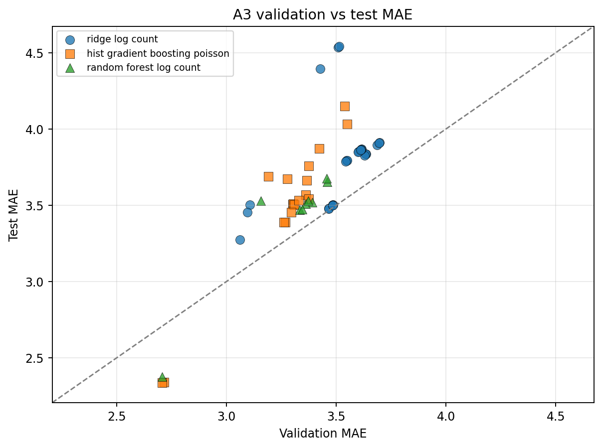

`/home/tim/Documents/ville_ai/indices_BACKUP_before_clean_push/urban_graph_benchmark/outputs/mtl_311_water_v0/baselines/A3_feature_parity_tabular_spatial_block_with_plots/plots/a3_validation_vs_test_mae.png`

## selected test mae

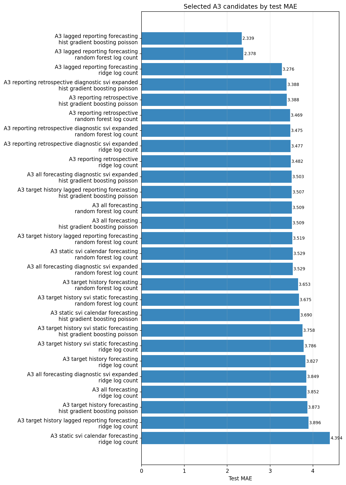

`/home/tim/Documents/ville_ai/indices_BACKUP_before_clean_push/urban_graph_benchmark/outputs/mtl_311_water_v0/baselines/A3_feature_parity_tabular_spatial_block_with_plots/plots/a3_selected_test_mae.png`

## selected strict forecasting calibration

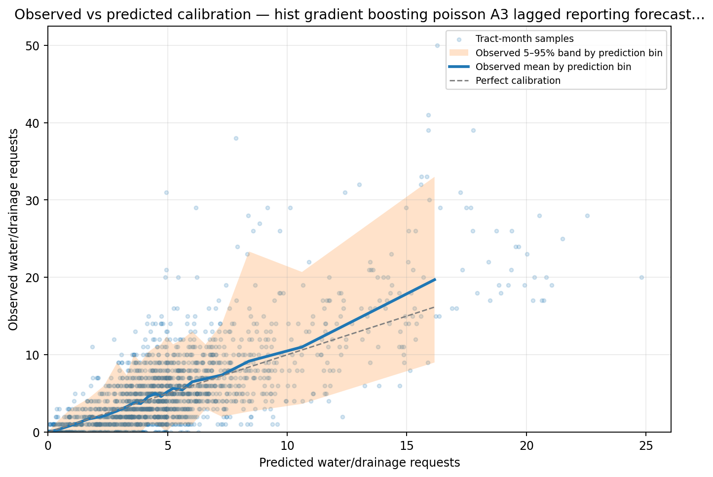

`/home/tim/Documents/ville_ai/indices_BACKUP_before_clean_push/urban_graph_benchmark/outputs/mtl_311_water_v0/baselines/A3_feature_parity_tabular_spatial_block_with_plots/plots/calibration__hist_gradient_boosting_poisson_A3_lagged_reporting_forecasting_hgb_poisson_02.png`

## selected strict forecasting monthly aggregate

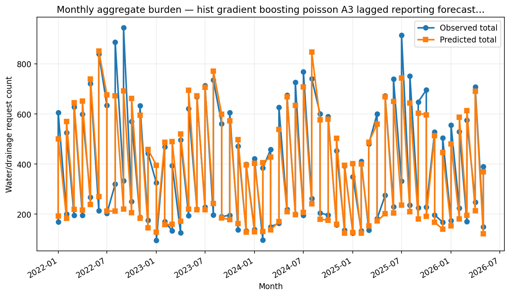

`/home/tim/Documents/ville_ai/indices_BACKUP_before_clean_push/urban_graph_benchmark/outputs/mtl_311_water_v0/baselines/A3_feature_parity_tabular_spatial_block_with_plots/plots/monthly_aggregate__hist_gradient_boosting_poisson_A3_lagged_reporting_forecasting_hgb_poisson_02.png`

## selected strict forecasting residual deciles

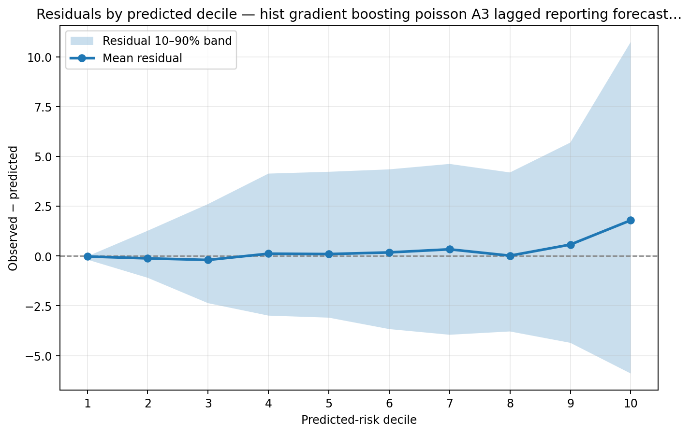

`/home/tim/Documents/ville_ai/indices_BACKUP_before_clean_push/urban_graph_benchmark/outputs/mtl_311_water_v0/baselines/A3_feature_parity_tabular_spatial_block_with_plots/plots/residual_deciles__hist_gradient_boosting_poisson_A3_lagged_reporting_forecasting_hgb_poisson_02.png`

## selected retrospective calibration

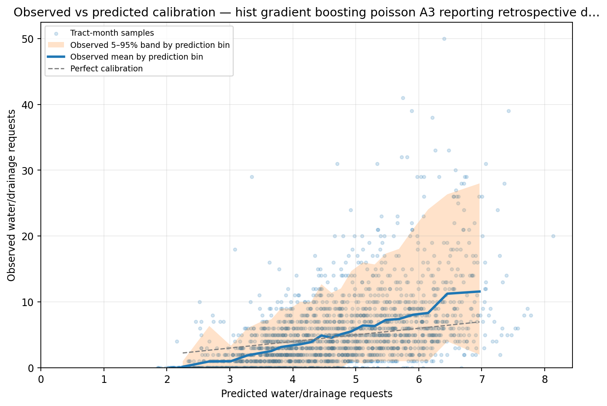

`/home/tim/Documents/ville_ai/indices_BACKUP_before_clean_push/urban_graph_benchmark/outputs/mtl_311_water_v0/baselines/A3_feature_parity_tabular_spatial_block_with_plots/plots/calibration__hist_gradient_boosting_poisson_A3_reporting_retrospective_diagnostic_svi_expanded_hgb_poisson_01.png`

## selected retrospective monthly aggregate

`/home/tim/Documents/ville_ai/indices_BACKUP_before_clean_push/urban_graph_benchmark/outputs/mtl_311_water_v0/baselines/A3_feature_parity_tabular_spatial_block_with_plots/plots/monthly_aggregate__hist_gradient_boosting_poisson_A3_reporting_retrospective_diagnostic_svi_expanded_hgb_poisson_01.png`

## selected retrospective residual deciles

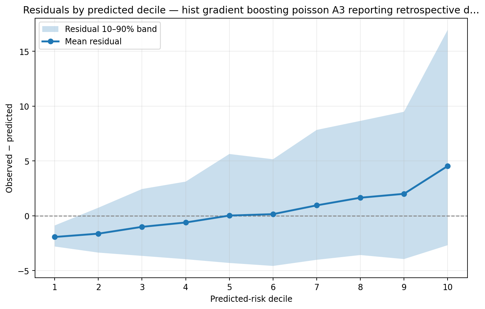

`/home/tim/Documents/ville_ai/indices_BACKUP_before_clean_push/urban_graph_benchmark/outputs/mtl_311_water_v0/baselines/A3_feature_parity_tabular_spatial_block_with_plots/plots/residual_deciles__hist_gradient_boosting_poisson_A3_reporting_retrospective_diagnostic_svi_expanded_hgb_poisson_01.png`

## best retrospective primary calibration

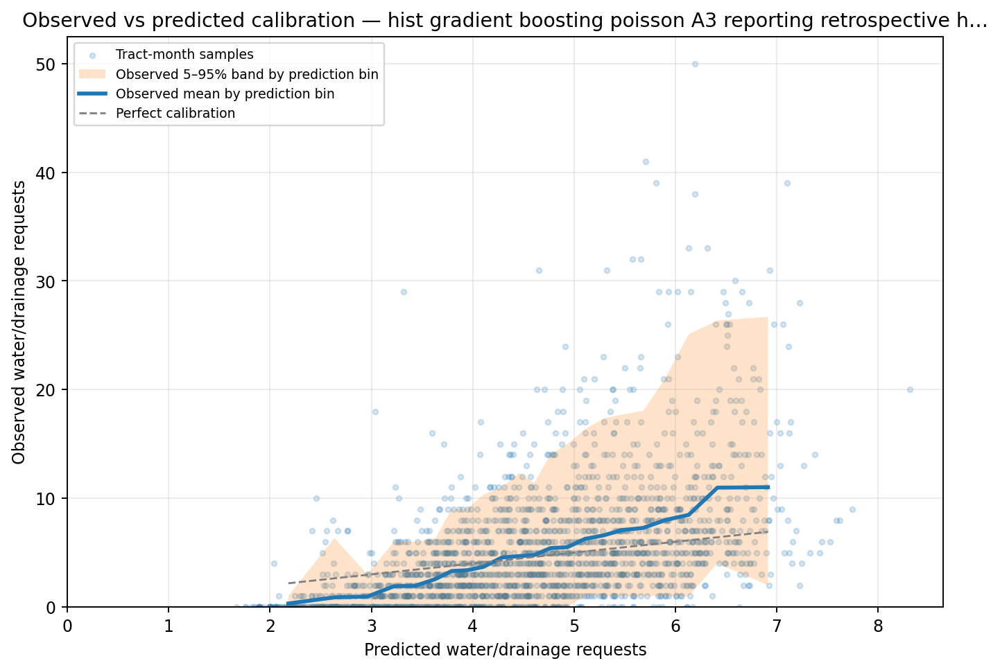

`/home/tim/Documents/ville_ai/indices_BACKUP_before_clean_push/urban_graph_benchmark/outputs/mtl_311_water_v0/baselines/A3_feature_parity_tabular_spatial_block_with_plots/plots/calibration__hist_gradient_boosting_poisson_A3_reporting_retrospective_hgb_poisson_01.png`

## best retrospective primary monthly aggregate

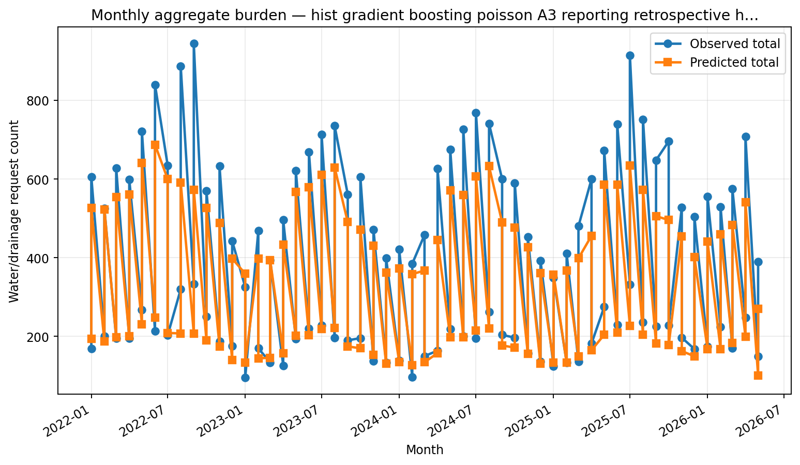

`/home/tim/Documents/ville_ai/indices_BACKUP_before_clean_push/urban_graph_benchmark/outputs/mtl_311_water_v0/baselines/A3_feature_parity_tabular_spatial_block_with_plots/plots/monthly_aggregate__hist_gradient_boosting_poisson_A3_reporting_retrospective_hgb_poisson_01.png`

## best retrospective primary residual deciles

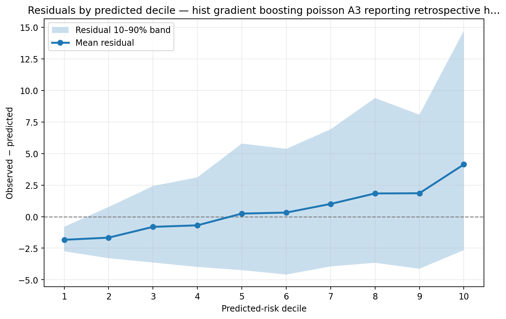

`/home/tim/Documents/ville_ai/indices_BACKUP_before_clean_push/urban_graph_benchmark/outputs/mtl_311_water_v0/baselines/A3_feature_parity_tabular_spatial_block_with_plots/plots/residual_deciles__hist_gradient_boosting_poisson_A3_reporting_retrospective_hgb_poisson_01.png`

## best static primary feature importance

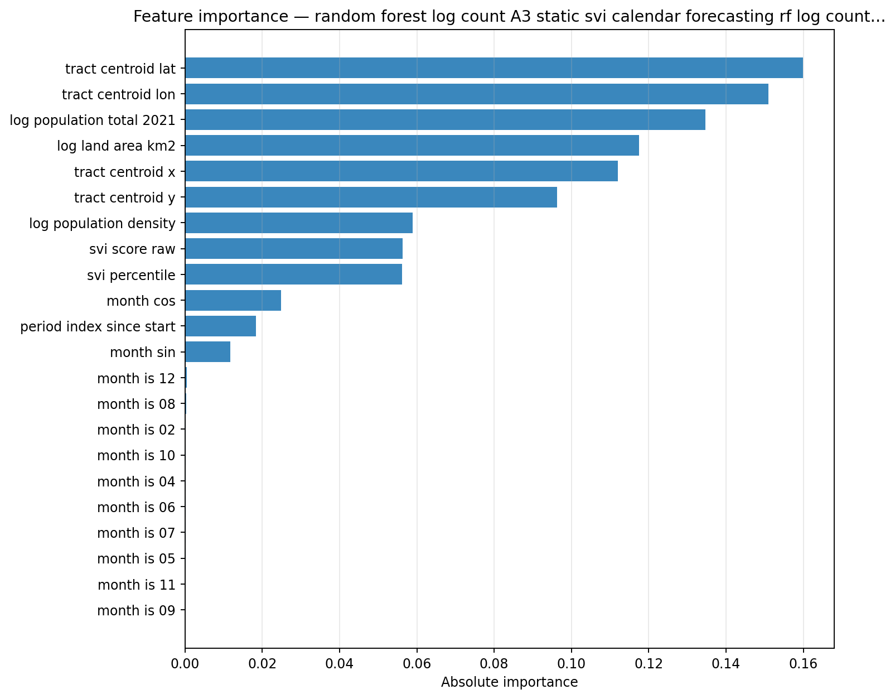

`/home/tim/Documents/ville_ai/indices_BACKUP_before_clean_push/urban_graph_benchmark/outputs/mtl_311_water_v0/baselines/A3_feature_parity_tabular_spatial_block_with_plots/plots/feature_importance__random_forest_log_count_A3_static_svi_calendar_forecasting_rf_log_count_conservative.png`

## best static primary calibration

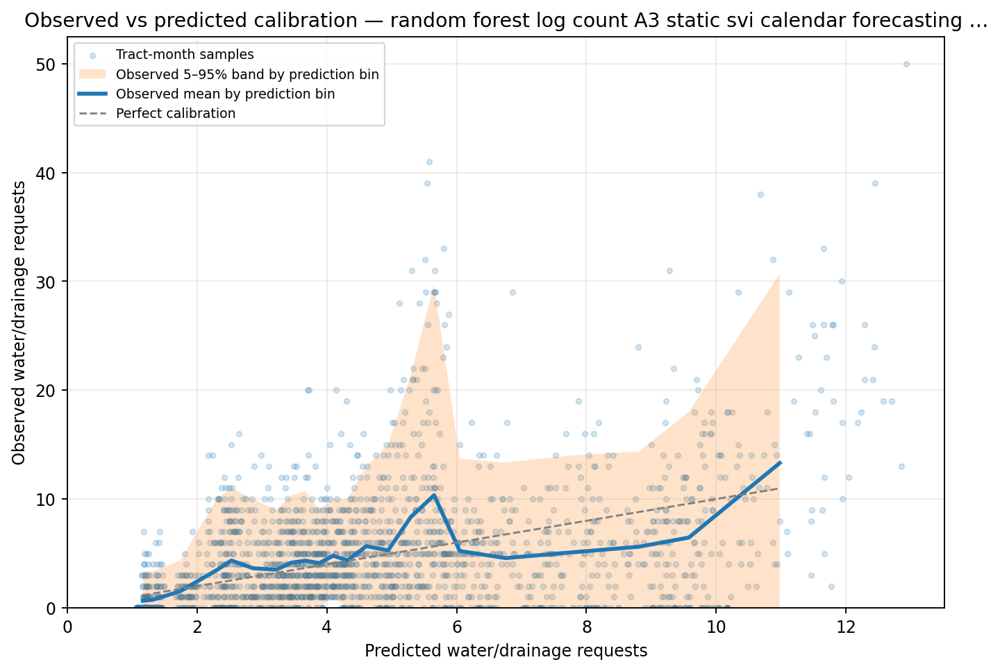

`/home/tim/Documents/ville_ai/indices_BACKUP_before_clean_push/urban_graph_benchmark/outputs/mtl_311_water_v0/baselines/A3_feature_parity_tabular_spatial_block_with_plots/plots/calibration__random_forest_log_count_A3_static_svi_calendar_forecasting_rf_log_count_conservative.png`

## best static primary monthly aggregate

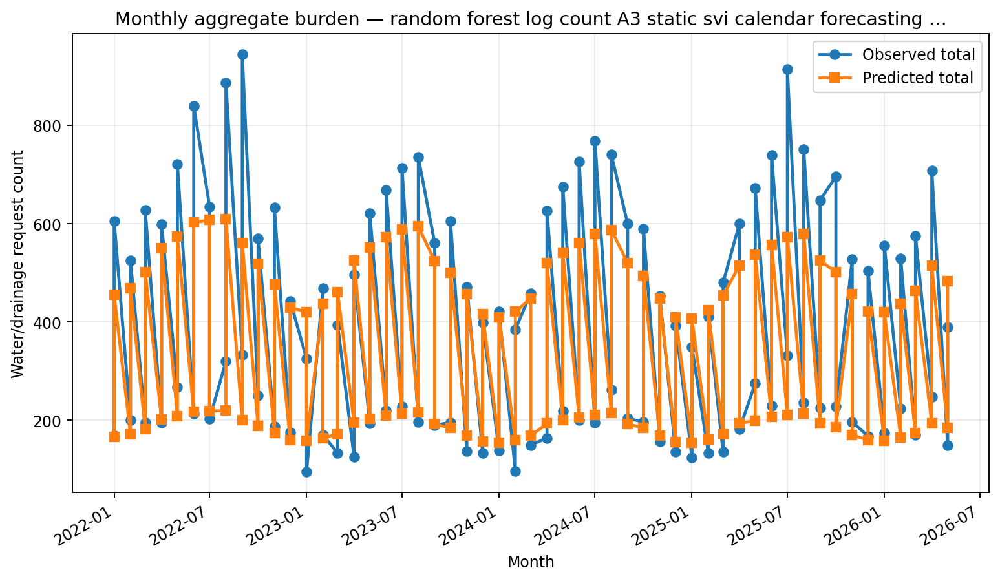

`/home/tim/Documents/ville_ai/indices_BACKUP_before_clean_push/urban_graph_benchmark/outputs/mtl_311_water_v0/baselines/A3_feature_parity_tabular_spatial_block_with_plots/plots/monthly_aggregate__random_forest_log_count_A3_static_svi_calendar_forecasting_rf_log_count_conservative.png`

## best static primary residual deciles

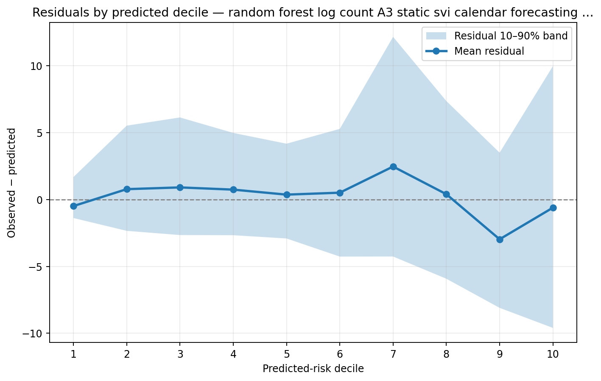

`/home/tim/Documents/ville_ai/indices_BACKUP_before_clean_push/urban_graph_benchmark/outputs/mtl_311_water_v0/baselines/A3_feature_parity_tabular_spatial_block_with_plots/plots/residual_deciles__random_forest_log_count_A3_static_svi_calendar_forecasting_rf_log_count_conservative.png`

## pdp 1d reporting history total 311 count non water drainage lag 1

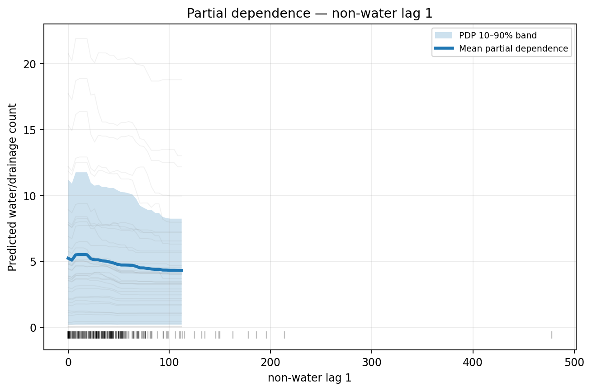

`/home/tim/Documents/ville_ai/indices_BACKUP_before_clean_push/urban_graph_benchmark/outputs/mtl_311_water_v0/baselines/A3_feature_parity_tabular_spatial_block_with_plots/plots/pdp_1d__hist_gradient_boosting_poisson_A3_lagged_reporting_forecasting_hgb_poisson_02__reporting_history_total_311_count_non_water_drainage_lag_1.png`

## pdp 1d requests history requests total lag 1

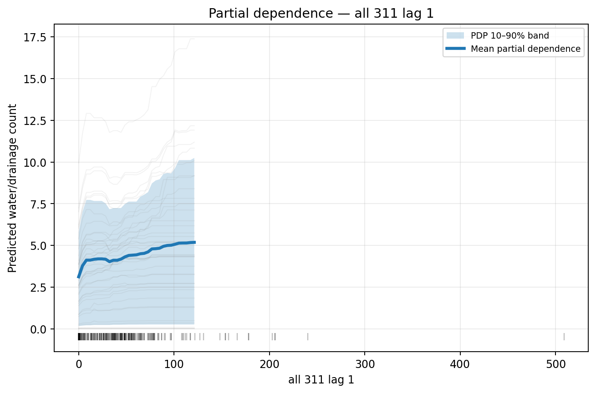

`/home/tim/Documents/ville_ai/indices_BACKUP_before_clean_push/urban_graph_benchmark/outputs/mtl_311_water_v0/baselines/A3_feature_parity_tabular_spatial_block_with_plots/plots/pdp_1d__hist_gradient_boosting_poisson_A3_lagged_reporting_forecasting_hgb_poisson_02__requests_history_requests_total_lag_1.png`

## pdp 1d reporting history total 311 count non water drainage roll3 mean shifted

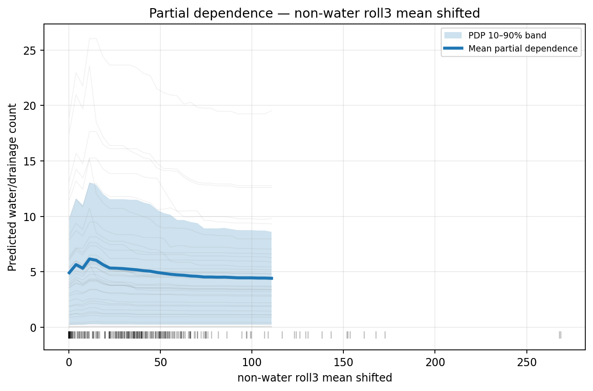

`/home/tim/Documents/ville_ai/indices_BACKUP_before_clean_push/urban_graph_benchmark/outputs/mtl_311_water_v0/baselines/A3_feature_parity_tabular_spatial_block_with_plots/plots/pdp_1d__hist_gradient_boosting_poisson_A3_lagged_reporting_forecasting_hgb_poisson_02__reporting_history_total_311_count_non_water_drainage_roll3_mean_shift1.png`

## pdp 1d requests history requests total roll3 mean shifted

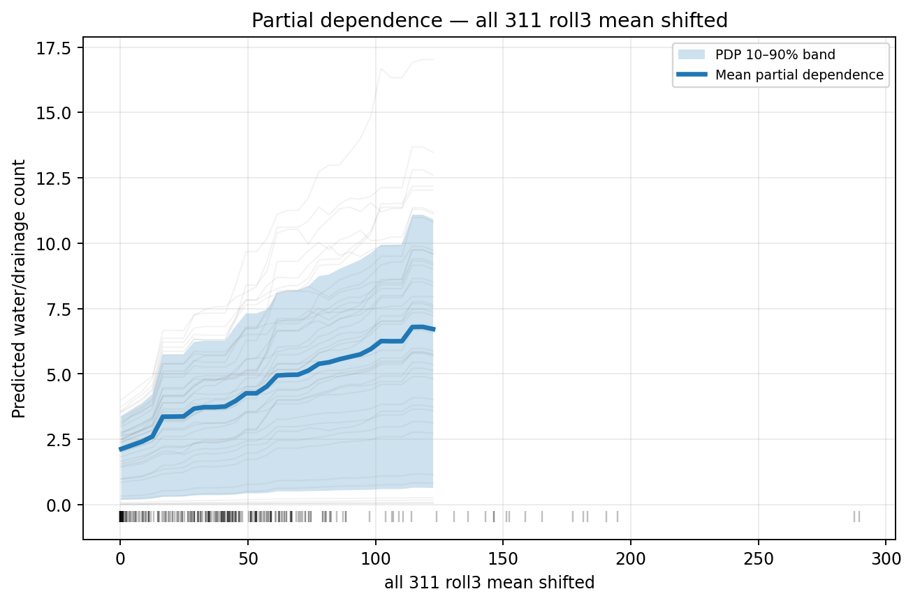

`/home/tim/Documents/ville_ai/indices_BACKUP_before_clean_push/urban_graph_benchmark/outputs/mtl_311_water_v0/baselines/A3_feature_parity_tabular_spatial_block_with_plots/plots/pdp_1d__hist_gradient_boosting_poisson_A3_lagged_reporting_forecasting_hgb_poisson_02__requests_history_requests_total_roll3_mean_shift1.png`

## pdp 1d reporting history total 311 count non water drainage lag 12

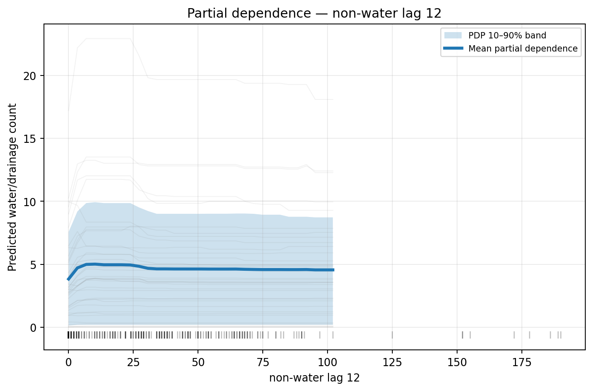

`/home/tim/Documents/ville_ai/indices_BACKUP_before_clean_push/urban_graph_benchmark/outputs/mtl_311_water_v0/baselines/A3_feature_parity_tabular_spatial_block_with_plots/plots/pdp_1d__hist_gradient_boosting_poisson_A3_lagged_reporting_forecasting_hgb_poisson_02__reporting_history_total_311_count_non_water_drainage_lag_12.png`

## pdp 1d requests history requests total lag 12

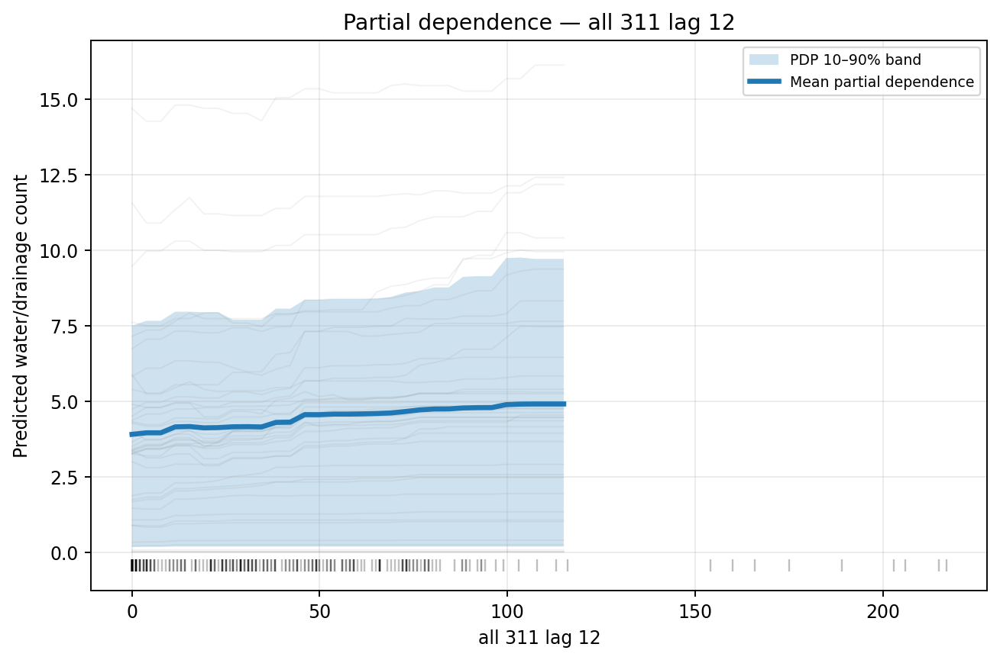

`/home/tim/Documents/ville_ai/indices_BACKUP_before_clean_push/urban_graph_benchmark/outputs/mtl_311_water_v0/baselines/A3_feature_parity_tabular_spatial_block_with_plots/plots/pdp_1d__hist_gradient_boosting_poisson_A3_lagged_reporting_forecasting_hgb_poisson_02__requests_history_requests_total_lag_12.png`

## surface 1 1

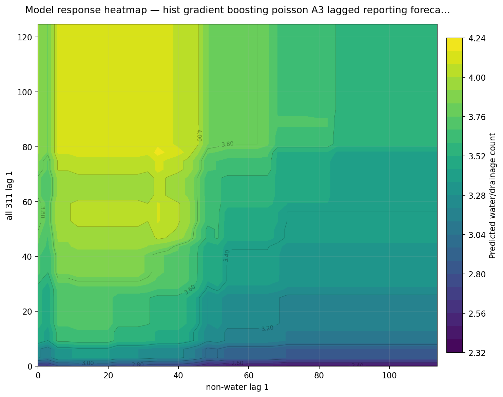

`/home/tim/Documents/ville_ai/indices_BACKUP_before_clean_push/urban_graph_benchmark/outputs/mtl_311_water_v0/baselines/A3_feature_parity_tabular_spatial_block_with_plots/plots/surface_heatmap__hist_gradient_boosting_poisson_A3_lagged_reporting_forecasting_hgb_poisson_02__reporting_history_total_311_count_non_water_drainage_lag_1__requests_history_requests_total_lag_1.png`

## surface 1 2

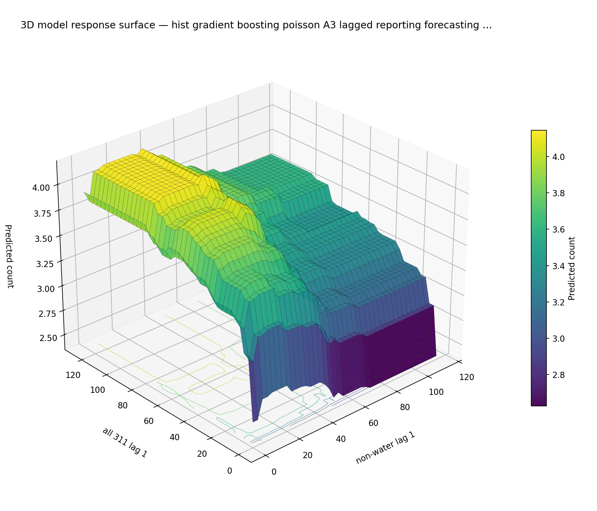

`/home/tim/Documents/ville_ai/indices_BACKUP_before_clean_push/urban_graph_benchmark/outputs/mtl_311_water_v0/baselines/A3_feature_parity_tabular_spatial_block_with_plots/plots/surface_3d__hist_gradient_boosting_poisson_A3_lagged_reporting_forecasting_hgb_poisson_02__reporting_history_total_311_count_non_water_drainage_lag_1__requests_history_requests_total_lag_1.png`

## surface 2 1

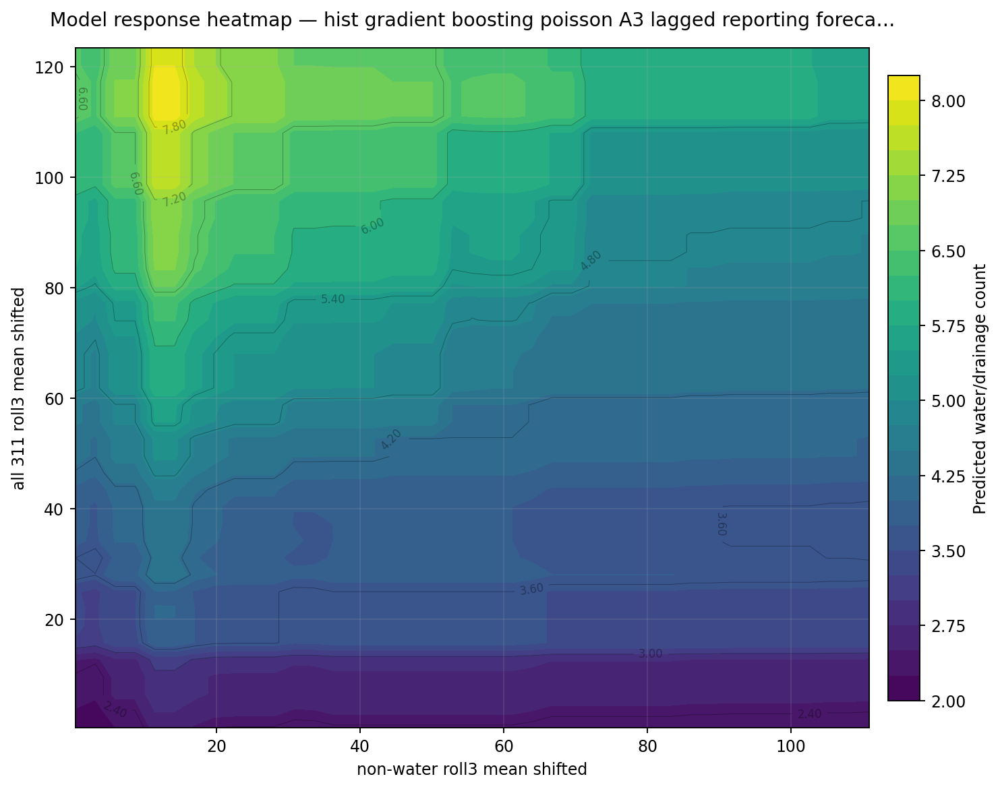

`/home/tim/Documents/ville_ai/indices_BACKUP_before_clean_push/urban_graph_benchmark/outputs/mtl_311_water_v0/baselines/A3_feature_parity_tabular_spatial_block_with_plots/plots/surface_heatmap__hist_gradient_boosting_poisson_A3_lagged_reporting_forecasting_hgb_poisson_02__reporting_history_total_311_count_non_water_drainage_roll3_mean_shift1__requests_history_requests_total_roll3_mean_shift1.png`

## surface 2 2

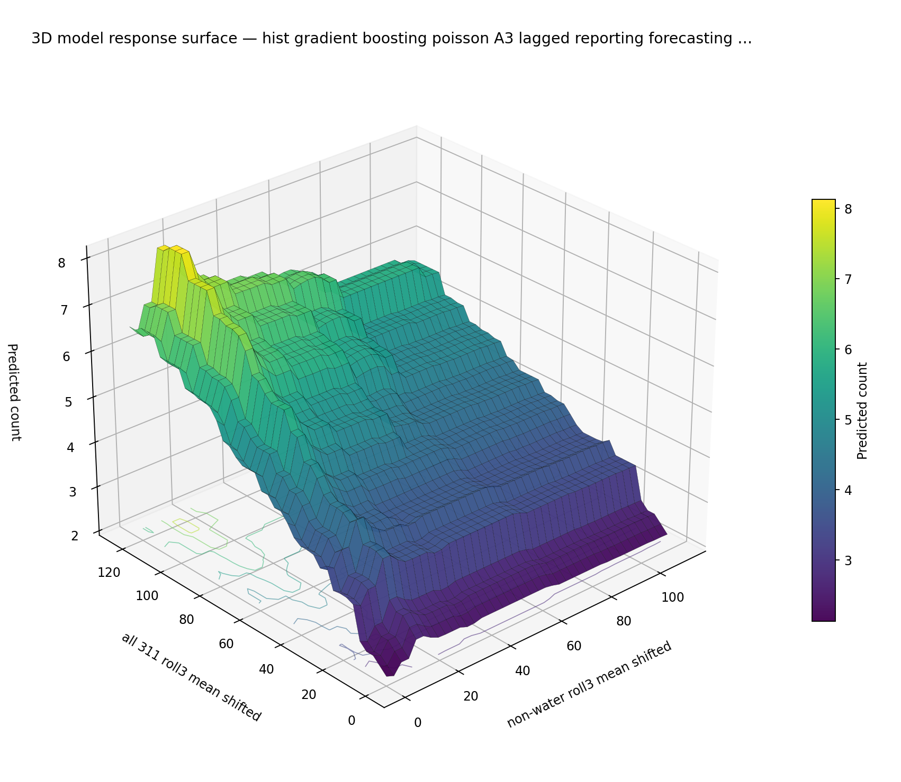

`/home/tim/Documents/ville_ai/indices_BACKUP_before_clean_push/urban_graph_benchmark/outputs/mtl_311_water_v0/baselines/A3_feature_parity_tabular_spatial_block_with_plots/plots/surface_3d__hist_gradient_boosting_poisson_A3_lagged_reporting_forecasting_hgb_poisson_02__reporting_history_total_311_count_non_water_drainage_roll3_mean_shift1__requests_history_requests_total_roll3_mean_shift1.png`

## surface 3 1

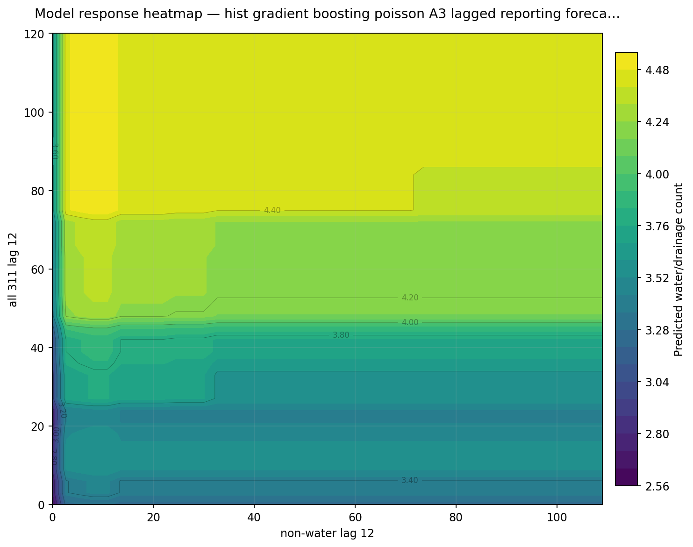

`/home/tim/Documents/ville_ai/indices_BACKUP_before_clean_push/urban_graph_benchmark/outputs/mtl_311_water_v0/baselines/A3_feature_parity_tabular_spatial_block_with_plots/plots/surface_heatmap__hist_gradient_boosting_poisson_A3_lagged_reporting_forecasting_hgb_poisson_02__reporting_history_total_311_count_non_water_drainage_lag_12__requests_history_requests_total_lag_12.png`

## surface 3 2

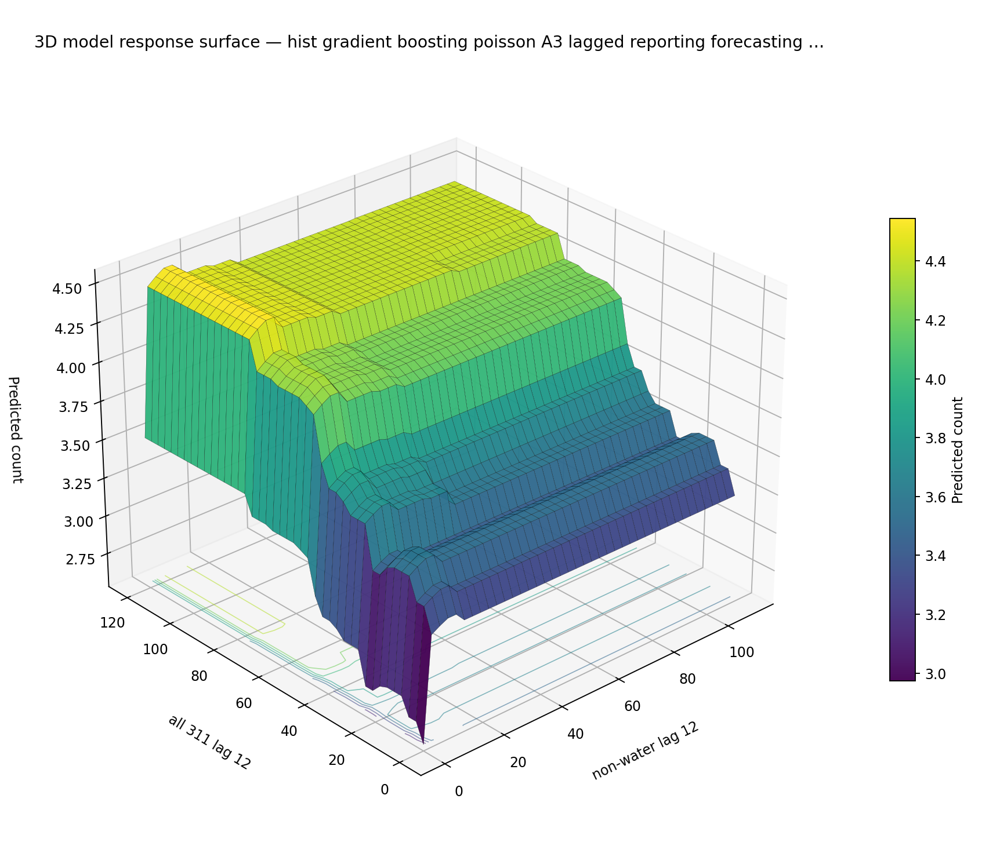

`/home/tim/Documents/ville_ai/indices_BACKUP_before_clean_push/urban_graph_benchmark/outputs/mtl_311_water_v0/baselines/A3_feature_parity_tabular_spatial_block_with_plots/plots/surface_3d__hist_gradient_boosting_poisson_A3_lagged_reporting_forecasting_hgb_poisson_02__reporting_history_total_311_count_non_water_drainage_lag_12__requests_history_requests_total_lag_12.png`

## surface 4 1

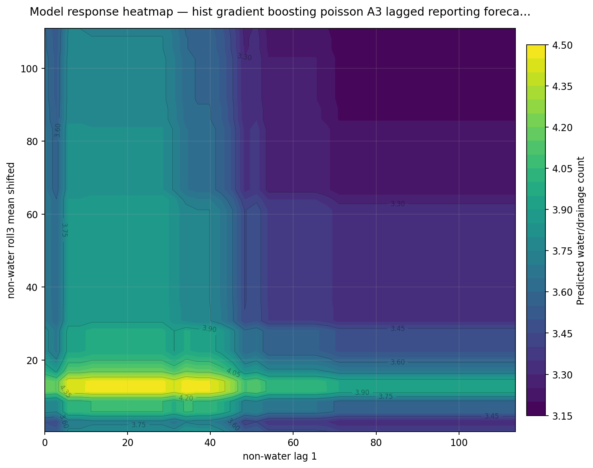

`/home/tim/Documents/ville_ai/indices_BACKUP_before_clean_push/urban_graph_benchmark/outputs/mtl_311_water_v0/baselines/A3_feature_parity_tabular_spatial_block_with_plots/plots/surface_heatmap__hist_gradient_boosting_poisson_A3_lagged_reporting_forecasting_hgb_poisson_02__reporting_history_total_311_count_non_water_drainage_lag_1__reporting_history_total_311_count_non_water_drainage_roll3_mean_shift1.png`

## surface 4 2

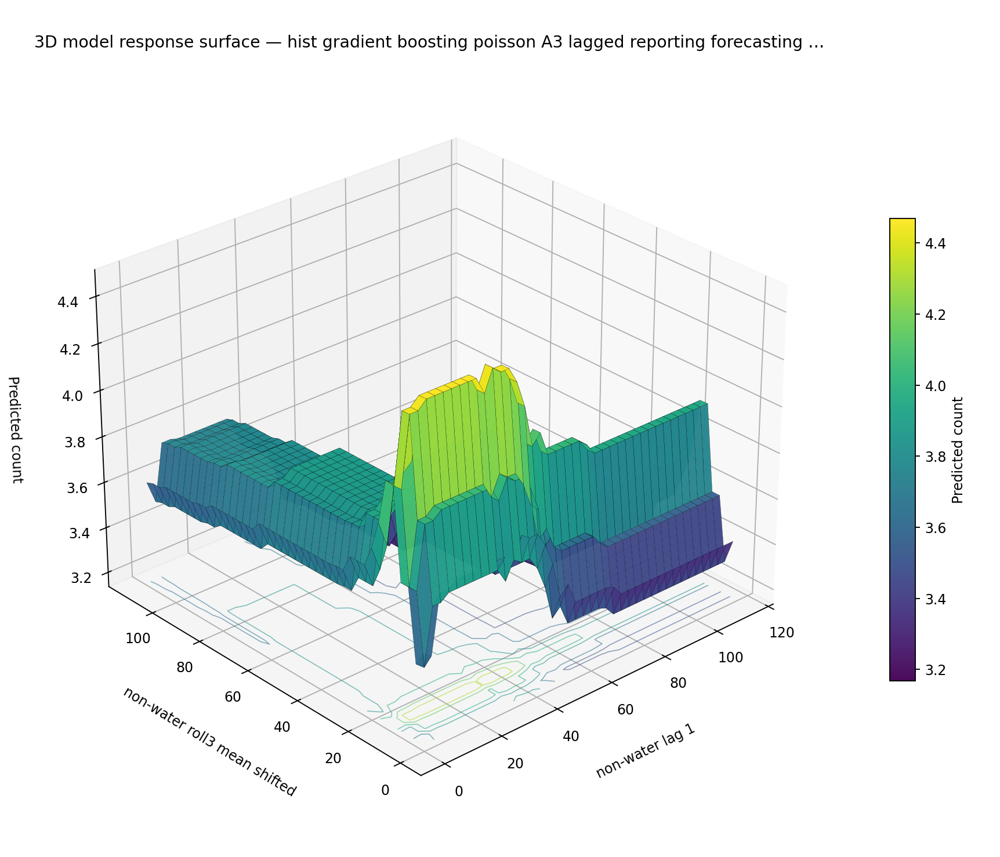

`/home/tim/Documents/ville_ai/indices_BACKUP_before_clean_push/urban_graph_benchmark/outputs/mtl_311_water_v0/baselines/A3_feature_parity_tabular_spatial_block_with_plots/plots/surface_3d__hist_gradient_boosting_poisson_A3_lagged_reporting_forecasting_hgb_poisson_02__reporting_history_total_311_count_non_water_drainage_lag_1__reporting_history_total_311_count_non_water_drainage_roll3_mean_shift1.png`

## surface 5 1

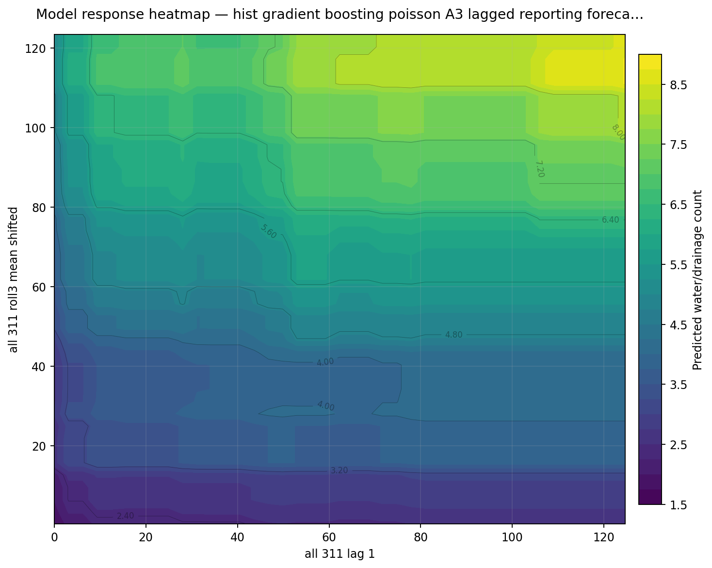

`/home/tim/Documents/ville_ai/indices_BACKUP_before_clean_push/urban_graph_benchmark/outputs/mtl_311_water_v0/baselines/A3_feature_parity_tabular_spatial_block_with_plots/plots/surface_heatmap__hist_gradient_boosting_poisson_A3_lagged_reporting_forecasting_hgb_poisson_02__requests_history_requests_total_lag_1__requests_history_requests_total_roll3_mean_shift1.png`

## surface 5 2

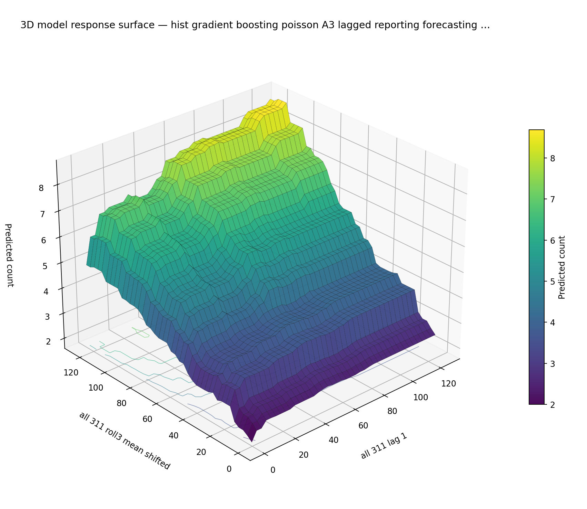

`/home/tim/Documents/ville_ai/indices_BACKUP_before_clean_push/urban_graph_benchmark/outputs/mtl_311_water_v0/baselines/A3_feature_parity_tabular_spatial_block_with_plots/plots/surface_3d__hist_gradient_boosting_poisson_A3_lagged_reporting_forecasting_hgb_poisson_02__requests_history_requests_total_lag_1__requests_history_requests_total_roll3_mean_shift1.png`
