# A3 model-behavior plots

These figures are generated by `a3_tabular_feature_parity_with_plots.py`. They are predictive-behavior diagnostics, not causal effect estimates.

## validation vs test mae

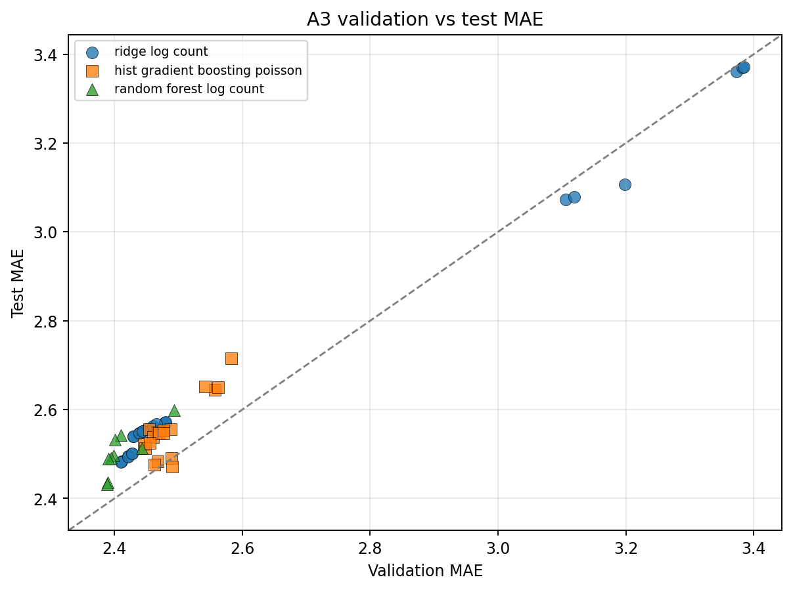

`/home/tim/Documents/ville_ai/indices_BACKUP_before_clean_push/urban_graph_benchmark/outputs/mtl_311_water_v0/baselines/A3_feature_parity_tabular_with_plots/plots/a3_validation_vs_test_mae.png`

## selected test mae

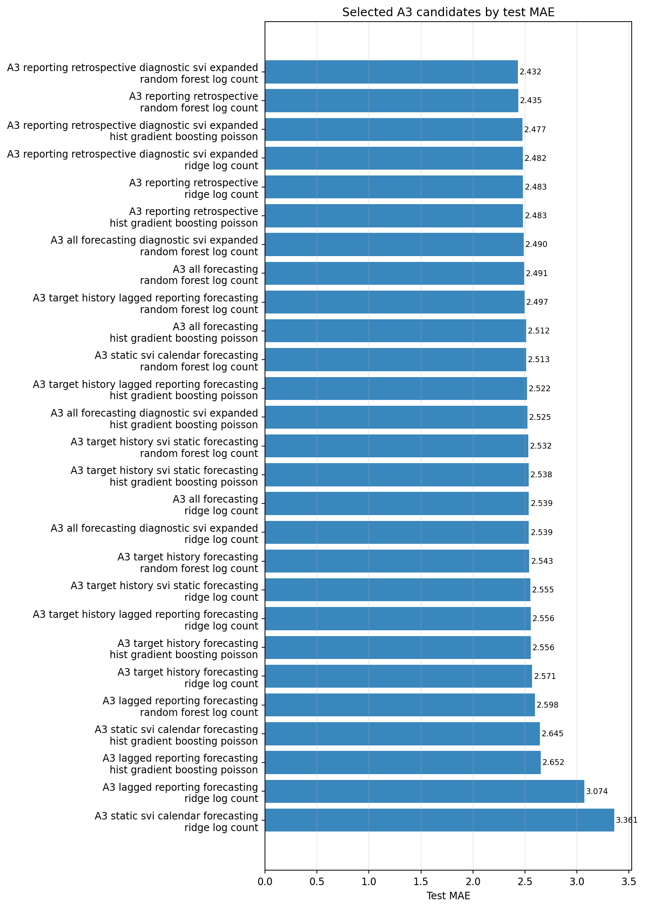

`/home/tim/Documents/ville_ai/indices_BACKUP_before_clean_push/urban_graph_benchmark/outputs/mtl_311_water_v0/baselines/A3_feature_parity_tabular_with_plots/plots/a3_selected_test_mae.png`

## best strict primary feature importance

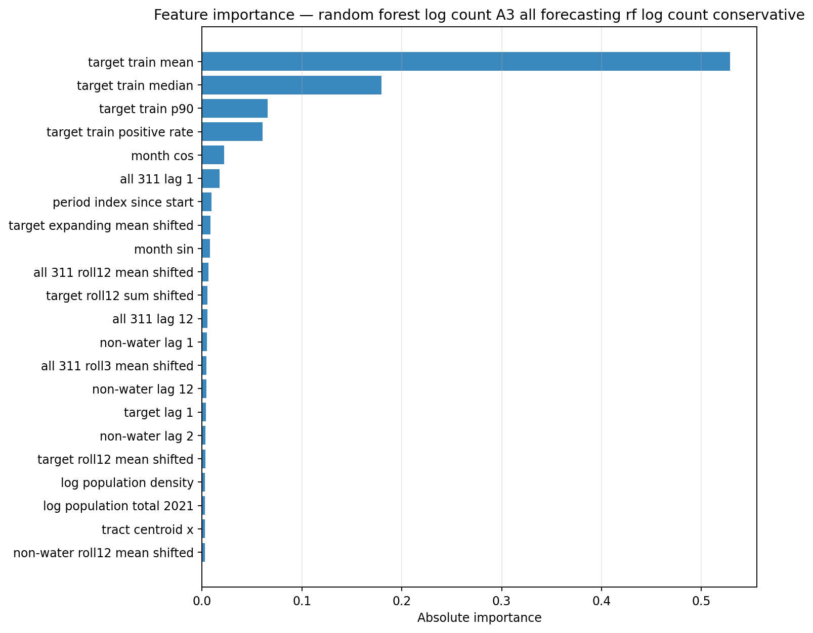

`/home/tim/Documents/ville_ai/indices_BACKUP_before_clean_push/urban_graph_benchmark/outputs/mtl_311_water_v0/baselines/A3_feature_parity_tabular_with_plots/plots/feature_importance__random_forest_log_count_A3_all_forecasting_rf_log_count_conservative.png`

## best strict primary calibration

`/home/tim/Documents/ville_ai/indices_BACKUP_before_clean_push/urban_graph_benchmark/outputs/mtl_311_water_v0/baselines/A3_feature_parity_tabular_with_plots/plots/calibration__random_forest_log_count_A3_all_forecasting_rf_log_count_conservative.png`

## best strict primary monthly aggregate

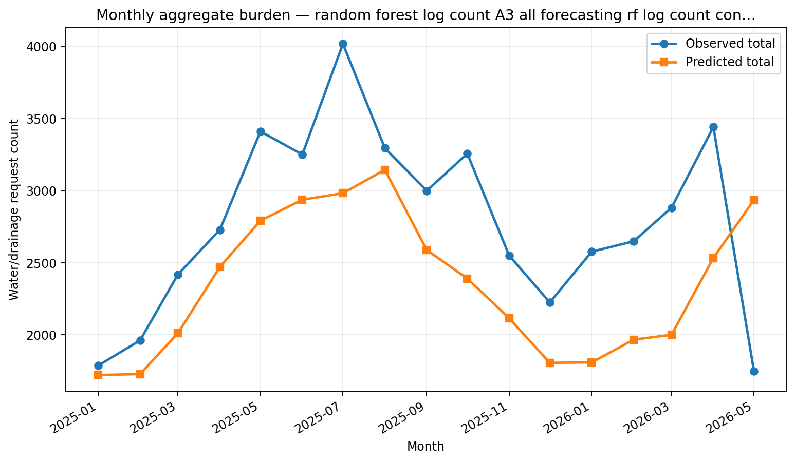

`/home/tim/Documents/ville_ai/indices_BACKUP_before_clean_push/urban_graph_benchmark/outputs/mtl_311_water_v0/baselines/A3_feature_parity_tabular_with_plots/plots/monthly_aggregate__random_forest_log_count_A3_all_forecasting_rf_log_count_conservative.png`

## best strict primary residual deciles

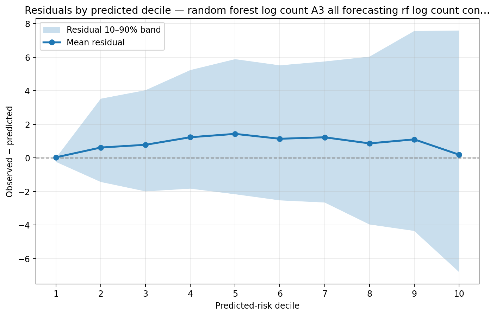

`/home/tim/Documents/ville_ai/indices_BACKUP_before_clean_push/urban_graph_benchmark/outputs/mtl_311_water_v0/baselines/A3_feature_parity_tabular_with_plots/plots/residual_deciles__random_forest_log_count_A3_all_forecasting_rf_log_count_conservative.png`

## best strict overall feature importance

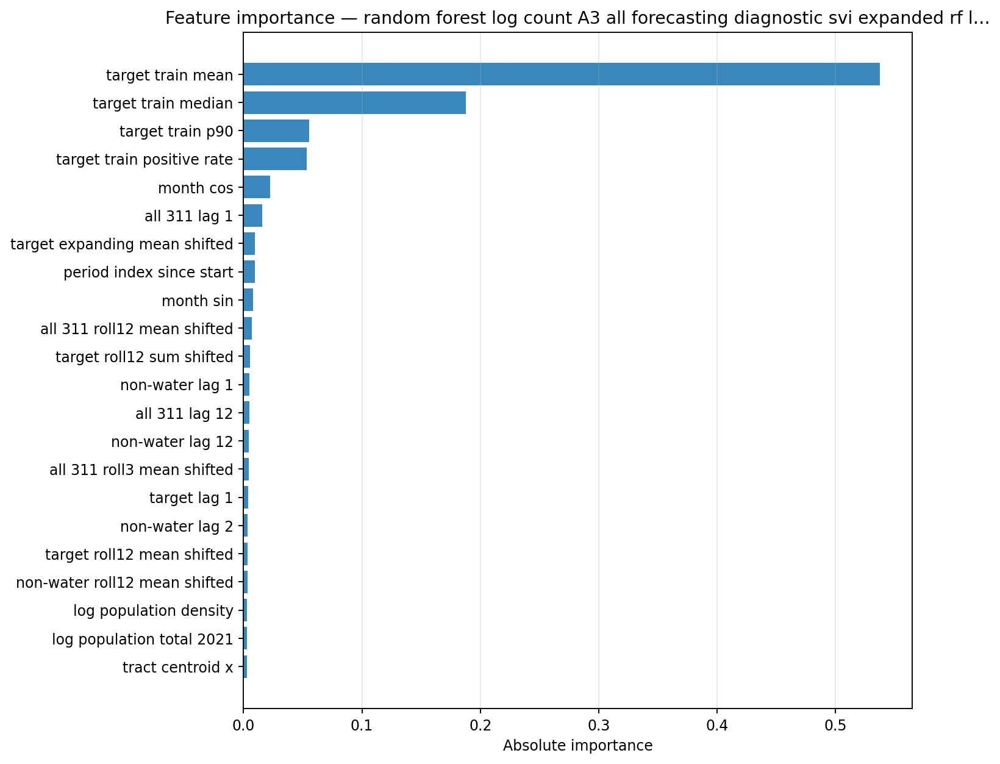

`/home/tim/Documents/ville_ai/indices_BACKUP_before_clean_push/urban_graph_benchmark/outputs/mtl_311_water_v0/baselines/A3_feature_parity_tabular_with_plots/plots/feature_importance__random_forest_log_count_A3_all_forecasting_diagnostic_svi_expanded_rf_log_count_conservative.png`

## best strict overall calibration

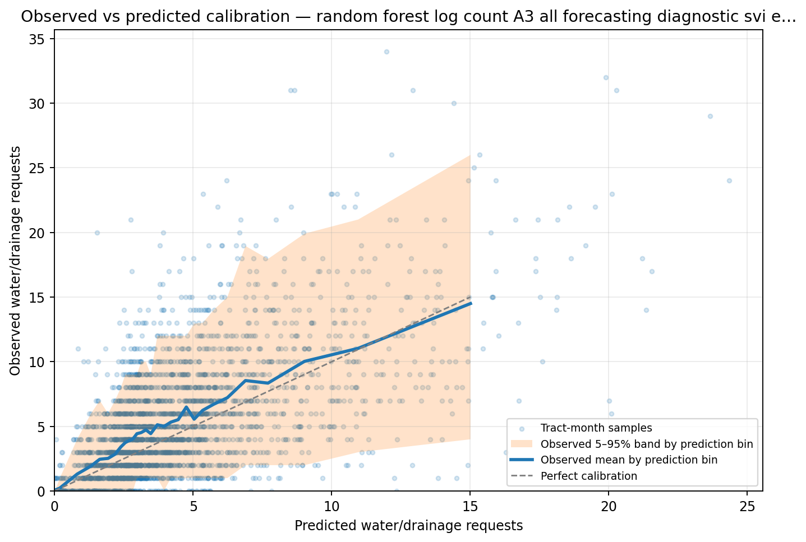

`/home/tim/Documents/ville_ai/indices_BACKUP_before_clean_push/urban_graph_benchmark/outputs/mtl_311_water_v0/baselines/A3_feature_parity_tabular_with_plots/plots/calibration__random_forest_log_count_A3_all_forecasting_diagnostic_svi_expanded_rf_log_count_conservative.png`

## best strict overall monthly aggregate

`/home/tim/Documents/ville_ai/indices_BACKUP_before_clean_push/urban_graph_benchmark/outputs/mtl_311_water_v0/baselines/A3_feature_parity_tabular_with_plots/plots/monthly_aggregate__random_forest_log_count_A3_all_forecasting_diagnostic_svi_expanded_rf_log_count_conservative.png`

## best strict overall residual deciles

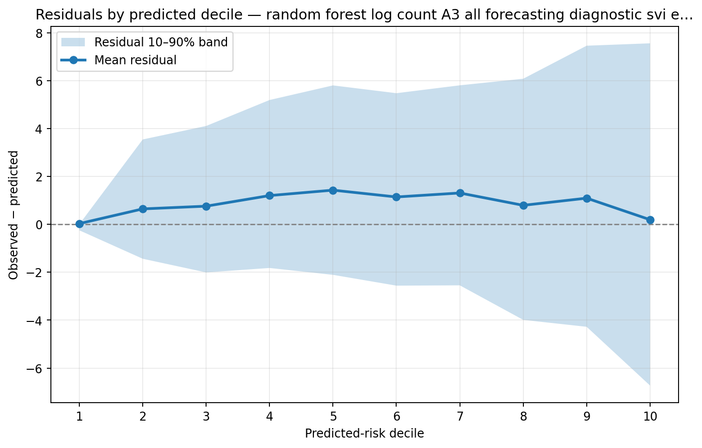

`/home/tim/Documents/ville_ai/indices_BACKUP_before_clean_push/urban_graph_benchmark/outputs/mtl_311_water_v0/baselines/A3_feature_parity_tabular_with_plots/plots/residual_deciles__random_forest_log_count_A3_all_forecasting_diagnostic_svi_expanded_rf_log_count_conservative.png`

## best retrospective primary feature importance

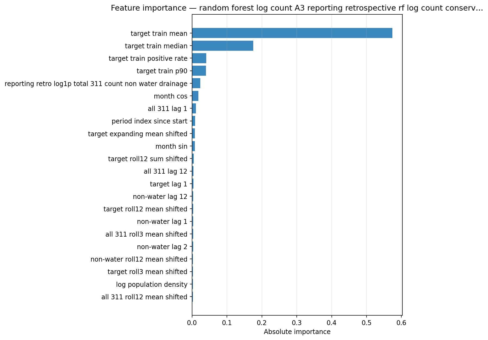

`/home/tim/Documents/ville_ai/indices_BACKUP_before_clean_push/urban_graph_benchmark/outputs/mtl_311_water_v0/baselines/A3_feature_parity_tabular_with_plots/plots/feature_importance__random_forest_log_count_A3_reporting_retrospective_rf_log_count_conservative.png`

## best retrospective primary calibration

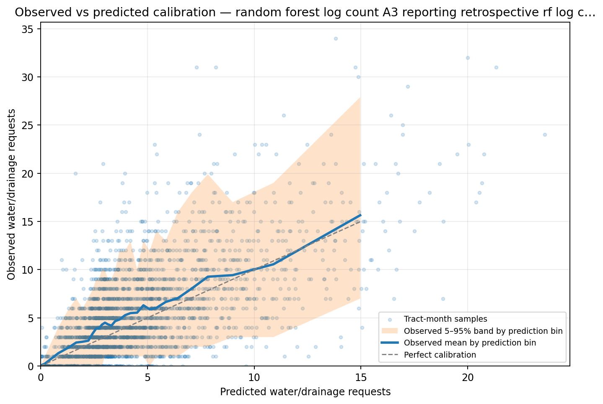

`/home/tim/Documents/ville_ai/indices_BACKUP_before_clean_push/urban_graph_benchmark/outputs/mtl_311_water_v0/baselines/A3_feature_parity_tabular_with_plots/plots/calibration__random_forest_log_count_A3_reporting_retrospective_rf_log_count_conservative.png`

## best retrospective primary monthly aggregate

`/home/tim/Documents/ville_ai/indices_BACKUP_before_clean_push/urban_graph_benchmark/outputs/mtl_311_water_v0/baselines/A3_feature_parity_tabular_with_plots/plots/monthly_aggregate__random_forest_log_count_A3_reporting_retrospective_rf_log_count_conservative.png`

## best retrospective primary residual deciles

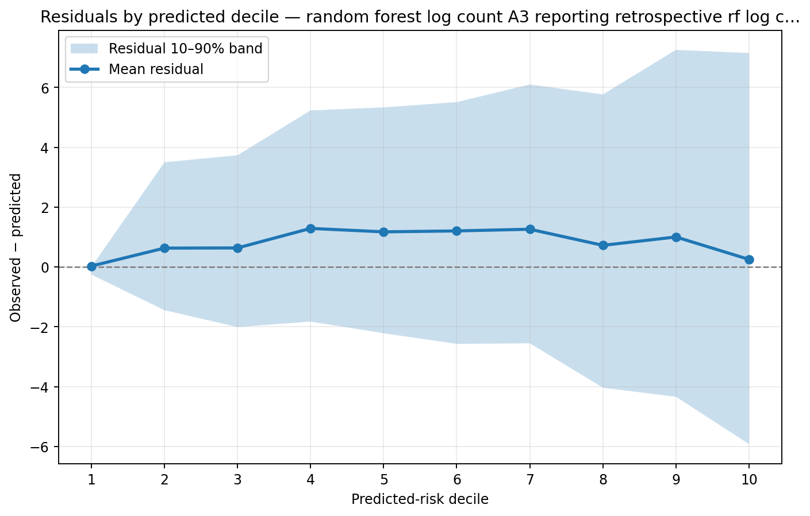

`/home/tim/Documents/ville_ai/indices_BACKUP_before_clean_push/urban_graph_benchmark/outputs/mtl_311_water_v0/baselines/A3_feature_parity_tabular_with_plots/plots/residual_deciles__random_forest_log_count_A3_reporting_retrospective_rf_log_count_conservative.png`

## best static primary feature importance

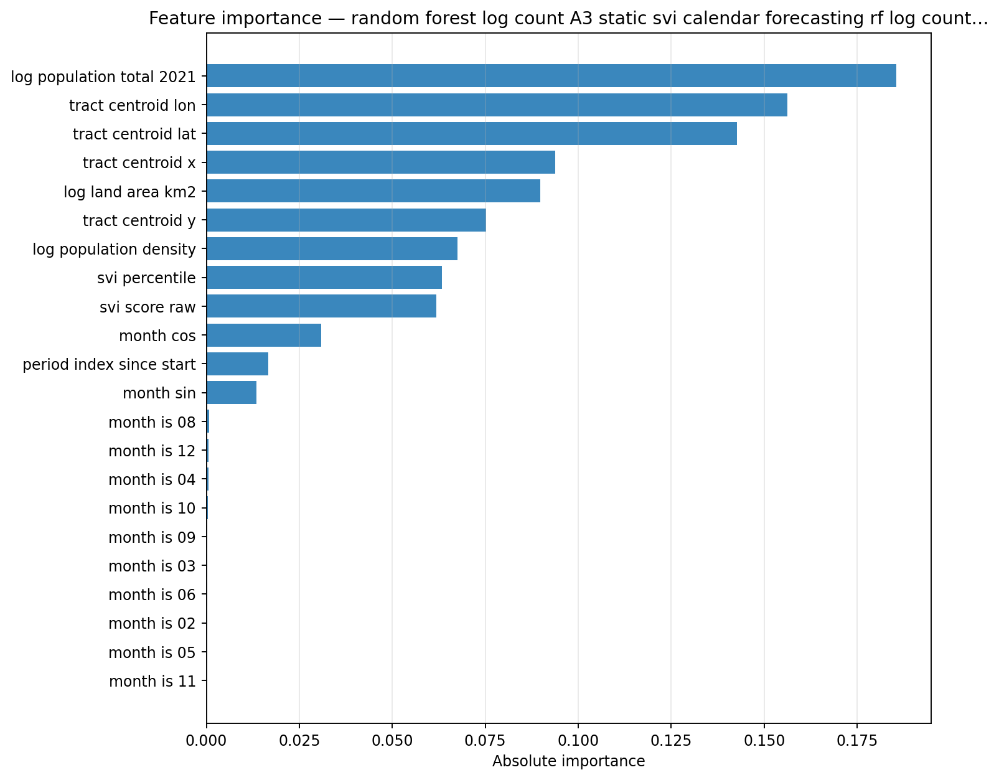

`/home/tim/Documents/ville_ai/indices_BACKUP_before_clean_push/urban_graph_benchmark/outputs/mtl_311_water_v0/baselines/A3_feature_parity_tabular_with_plots/plots/feature_importance__random_forest_log_count_A3_static_svi_calendar_forecasting_rf_log_count_conservative.png`

## best static primary calibration

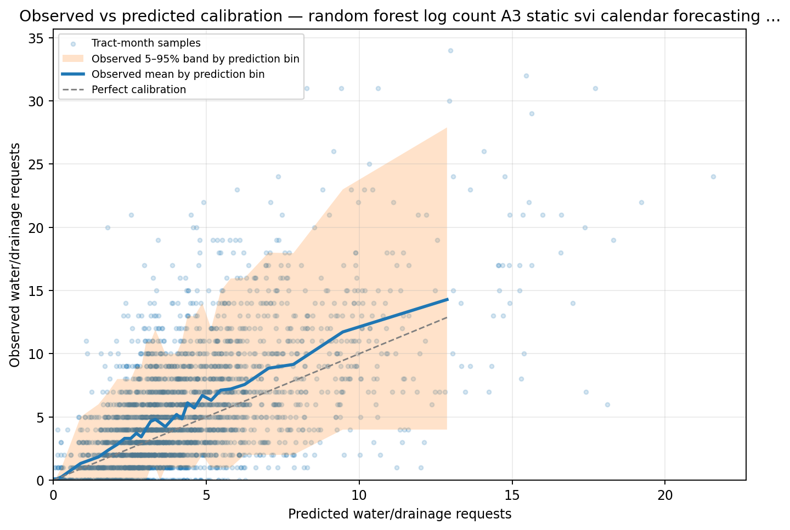

`/home/tim/Documents/ville_ai/indices_BACKUP_before_clean_push/urban_graph_benchmark/outputs/mtl_311_water_v0/baselines/A3_feature_parity_tabular_with_plots/plots/calibration__random_forest_log_count_A3_static_svi_calendar_forecasting_rf_log_count_conservative.png`

## best static primary monthly aggregate

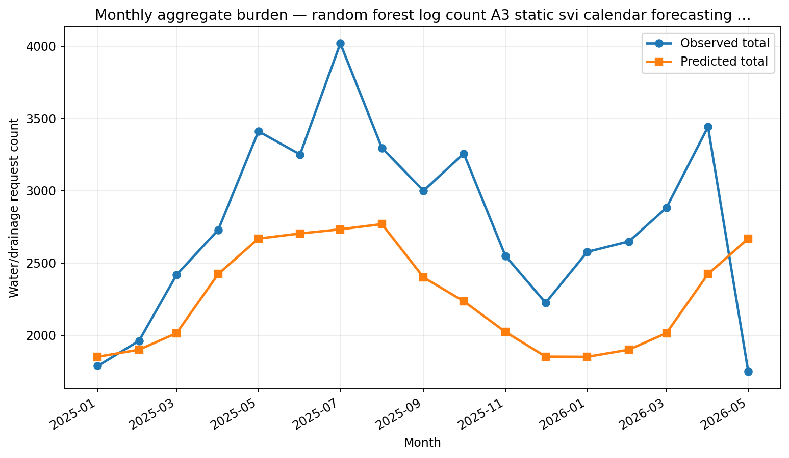

`/home/tim/Documents/ville_ai/indices_BACKUP_before_clean_push/urban_graph_benchmark/outputs/mtl_311_water_v0/baselines/A3_feature_parity_tabular_with_plots/plots/monthly_aggregate__random_forest_log_count_A3_static_svi_calendar_forecasting_rf_log_count_conservative.png`

## best static primary residual deciles

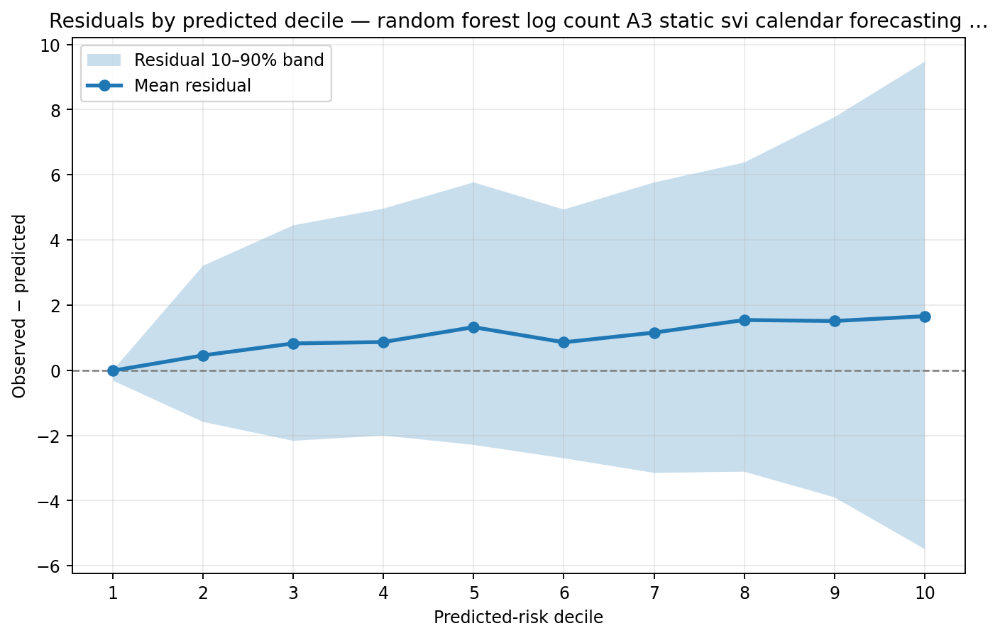

`/home/tim/Documents/ville_ai/indices_BACKUP_before_clean_push/urban_graph_benchmark/outputs/mtl_311_water_v0/baselines/A3_feature_parity_tabular_with_plots/plots/residual_deciles__random_forest_log_count_A3_static_svi_calendar_forecasting_rf_log_count_conservative.png`

## pdp 1d target train summary mean

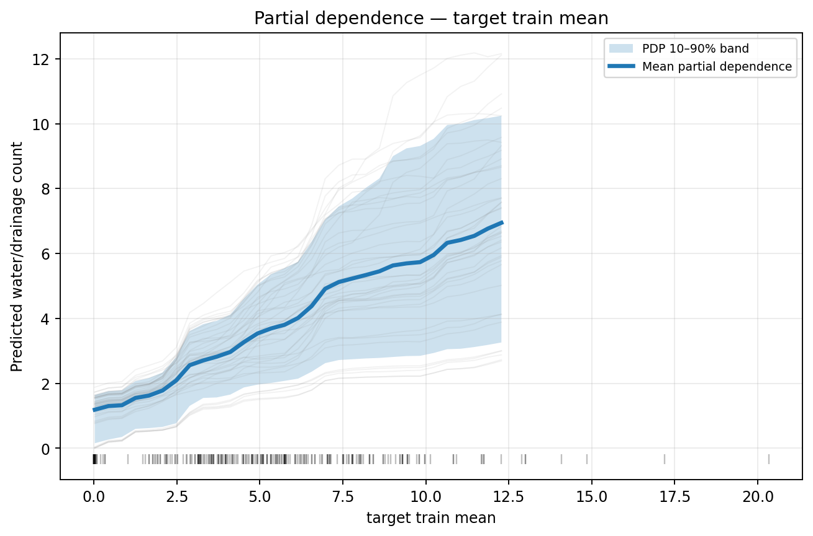

`/home/tim/Documents/ville_ai/indices_BACKUP_before_clean_push/urban_graph_benchmark/outputs/mtl_311_water_v0/baselines/A3_feature_parity_tabular_with_plots/plots/pdp_1d__random_forest_log_count_A3_all_forecasting_rf_log_count_conservative__target_train_summary_mean.png`

## pdp 1d target train summary median

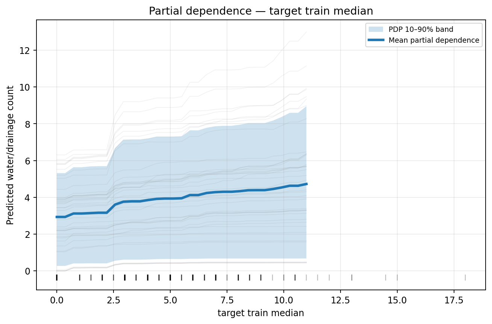

`/home/tim/Documents/ville_ai/indices_BACKUP_before_clean_push/urban_graph_benchmark/outputs/mtl_311_water_v0/baselines/A3_feature_parity_tabular_with_plots/plots/pdp_1d__random_forest_log_count_A3_all_forecasting_rf_log_count_conservative__target_train_summary_median.png`

## pdp 1d target train summary p90

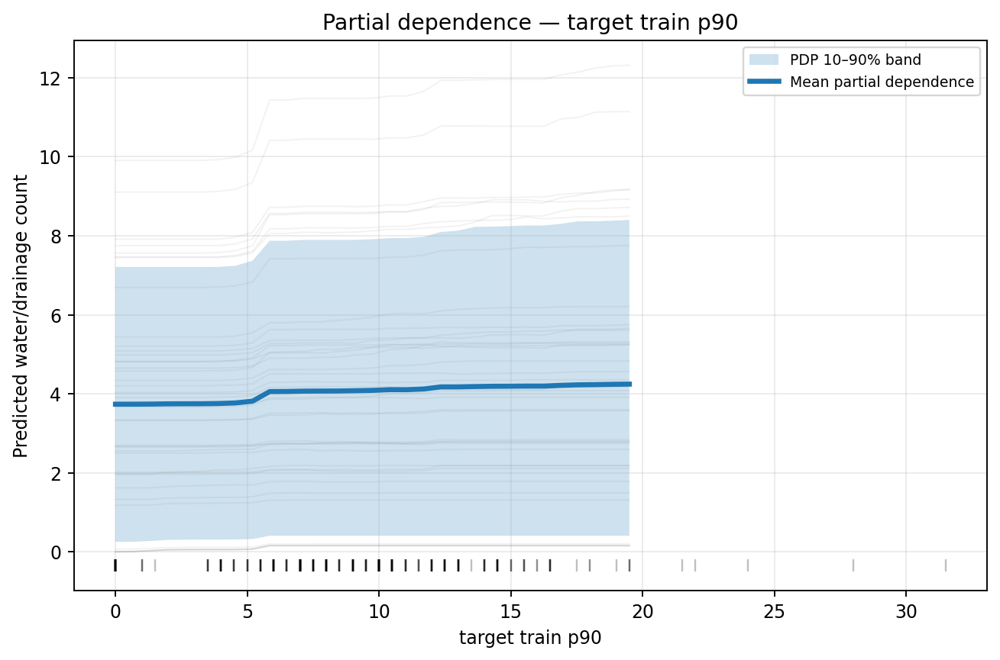

`/home/tim/Documents/ville_ai/indices_BACKUP_before_clean_push/urban_graph_benchmark/outputs/mtl_311_water_v0/baselines/A3_feature_parity_tabular_with_plots/plots/pdp_1d__random_forest_log_count_A3_all_forecasting_rf_log_count_conservative__target_train_summary_p90.png`

## pdp 1d target train summary positive rate

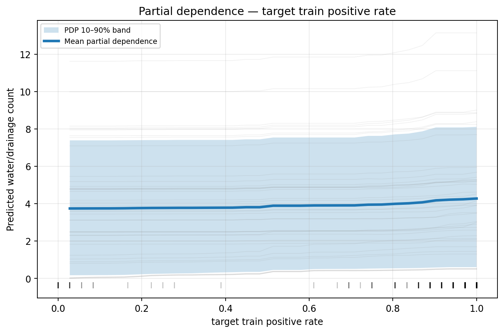

`/home/tim/Documents/ville_ai/indices_BACKUP_before_clean_push/urban_graph_benchmark/outputs/mtl_311_water_v0/baselines/A3_feature_parity_tabular_with_plots/plots/pdp_1d__random_forest_log_count_A3_all_forecasting_rf_log_count_conservative__target_train_summary_positive_rate.png`

## pdp 1d calendar month cos

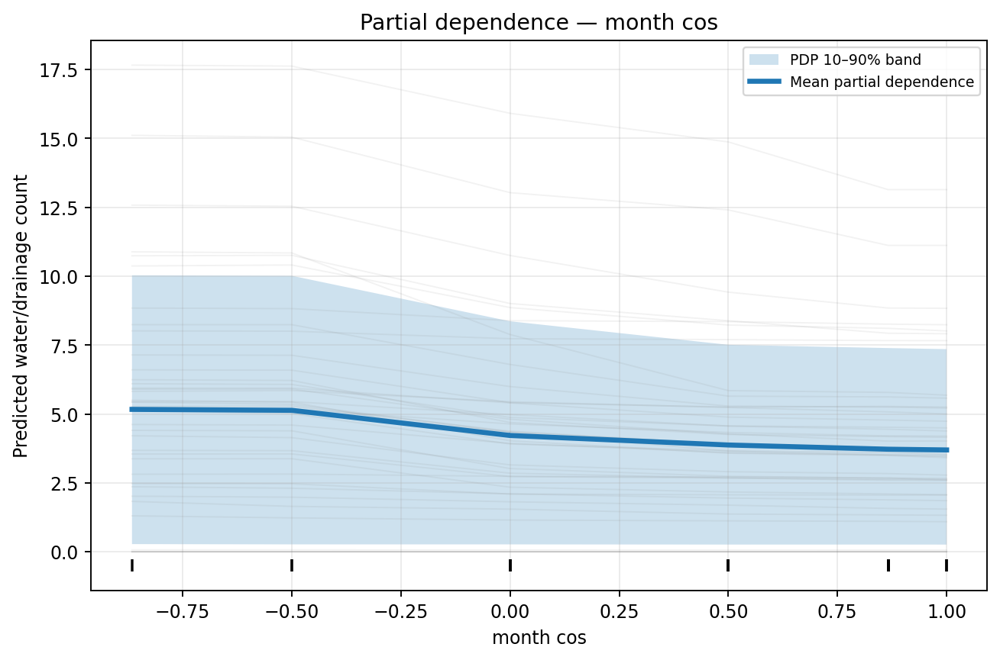

`/home/tim/Documents/ville_ai/indices_BACKUP_before_clean_push/urban_graph_benchmark/outputs/mtl_311_water_v0/baselines/A3_feature_parity_tabular_with_plots/plots/pdp_1d__random_forest_log_count_A3_all_forecasting_rf_log_count_conservative__calendar_month_cos.png`

## pdp 1d requests history requests total lag 1

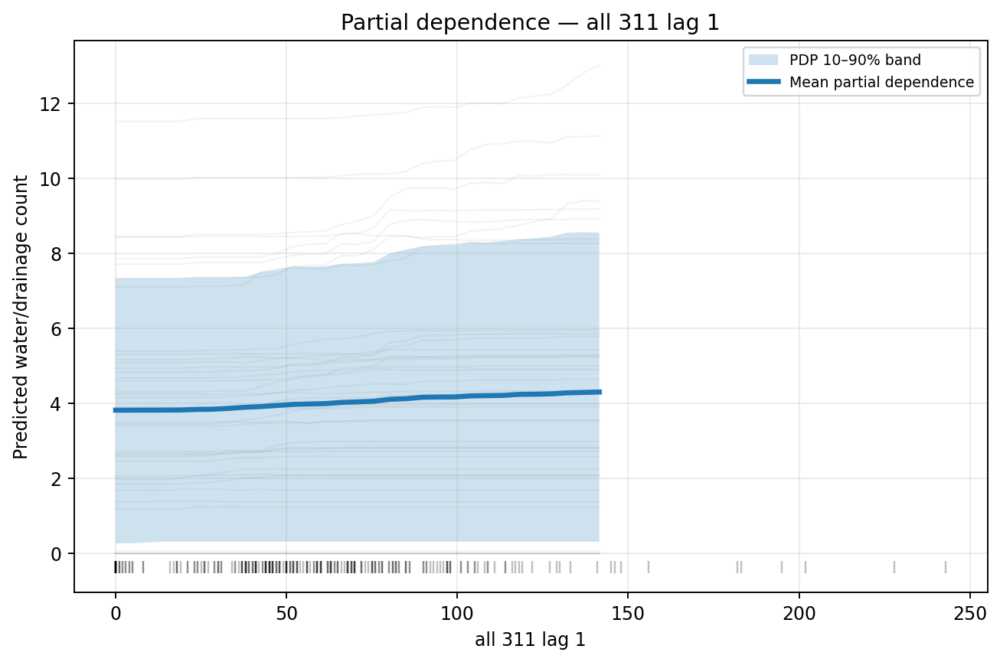

`/home/tim/Documents/ville_ai/indices_BACKUP_before_clean_push/urban_graph_benchmark/outputs/mtl_311_water_v0/baselines/A3_feature_parity_tabular_with_plots/plots/pdp_1d__random_forest_log_count_A3_all_forecasting_rf_log_count_conservative__requests_history_requests_total_lag_1.png`

## surface 1 1

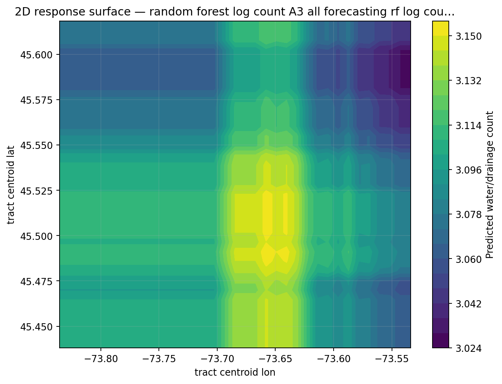

`/home/tim/Documents/ville_ai/indices_BACKUP_before_clean_push/urban_graph_benchmark/outputs/mtl_311_water_v0/baselines/A3_feature_parity_tabular_with_plots/plots/surface_heatmap__random_forest_log_count_A3_all_forecasting_rf_log_count_conservative__static_spatial_tract_centroid_lon__static_spatial_tract_centroid_lat.png`

## surface 1 2

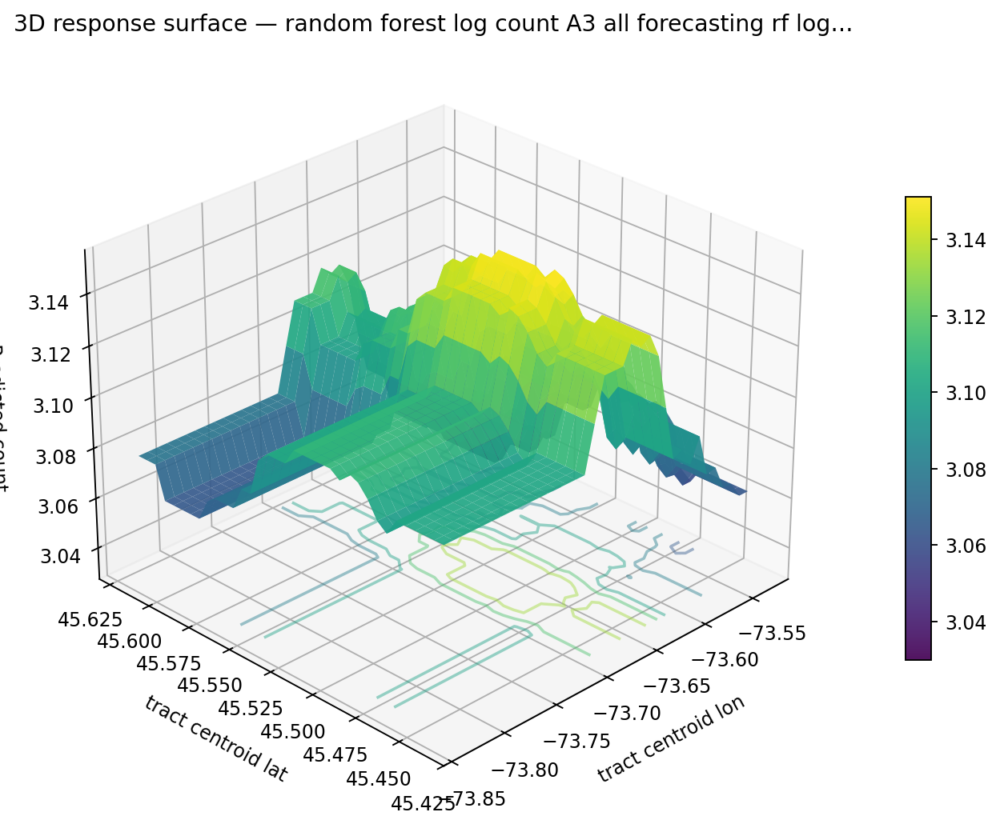

`/home/tim/Documents/ville_ai/indices_BACKUP_before_clean_push/urban_graph_benchmark/outputs/mtl_311_water_v0/baselines/A3_feature_parity_tabular_with_plots/plots/surface_3d__random_forest_log_count_A3_all_forecasting_rf_log_count_conservative__static_spatial_tract_centroid_lon__static_spatial_tract_centroid_lat.png`

## surface 2 1

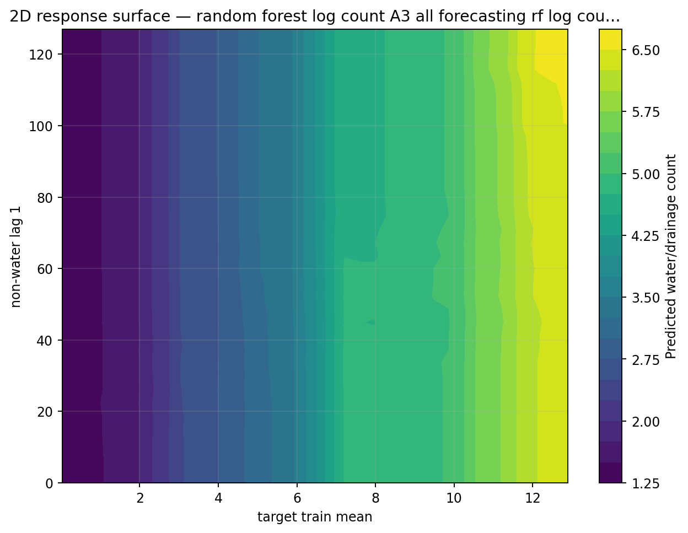

`/home/tim/Documents/ville_ai/indices_BACKUP_before_clean_push/urban_graph_benchmark/outputs/mtl_311_water_v0/baselines/A3_feature_parity_tabular_with_plots/plots/surface_heatmap__random_forest_log_count_A3_all_forecasting_rf_log_count_conservative__target_train_summary_mean__reporting_history_total_311_count_non_water_drainage_lag_1.png`

## surface 2 2

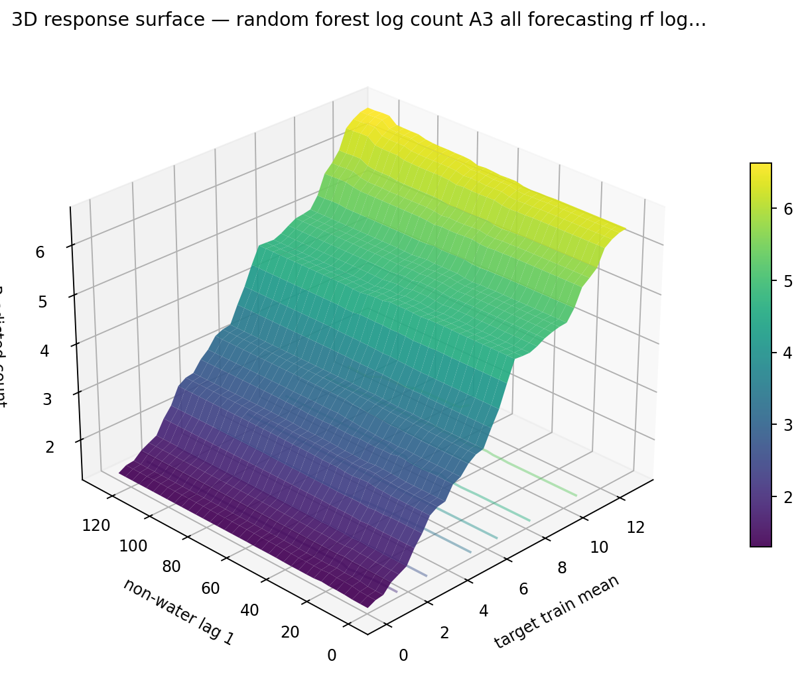

`/home/tim/Documents/ville_ai/indices_BACKUP_before_clean_push/urban_graph_benchmark/outputs/mtl_311_water_v0/baselines/A3_feature_parity_tabular_with_plots/plots/surface_3d__random_forest_log_count_A3_all_forecasting_rf_log_count_conservative__target_train_summary_mean__reporting_history_total_311_count_non_water_drainage_lag_1.png`

## surface 3 1

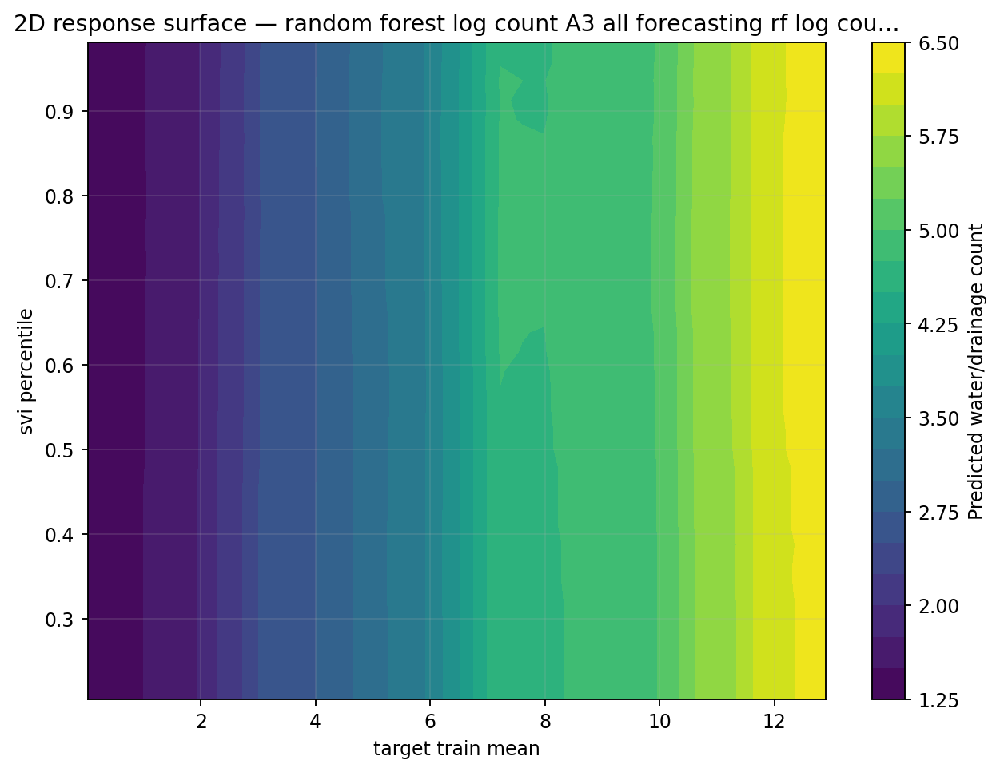

`/home/tim/Documents/ville_ai/indices_BACKUP_before_clean_push/urban_graph_benchmark/outputs/mtl_311_water_v0/baselines/A3_feature_parity_tabular_with_plots/plots/surface_heatmap__random_forest_log_count_A3_all_forecasting_rf_log_count_conservative__target_train_summary_mean__svi_primary_svi_percentile.png`

## surface 3 2

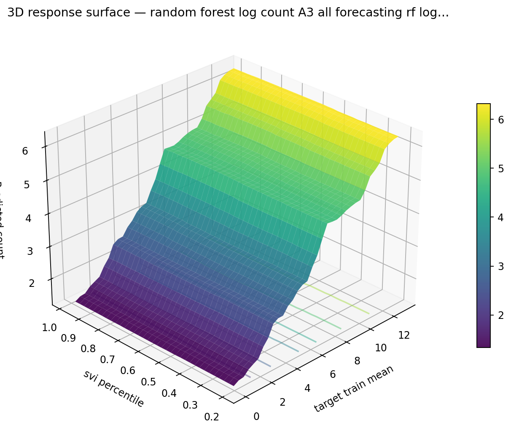

`/home/tim/Documents/ville_ai/indices_BACKUP_before_clean_push/urban_graph_benchmark/outputs/mtl_311_water_v0/baselines/A3_feature_parity_tabular_with_plots/plots/surface_3d__random_forest_log_count_A3_all_forecasting_rf_log_count_conservative__target_train_summary_mean__svi_primary_svi_percentile.png`

## surface 4 1

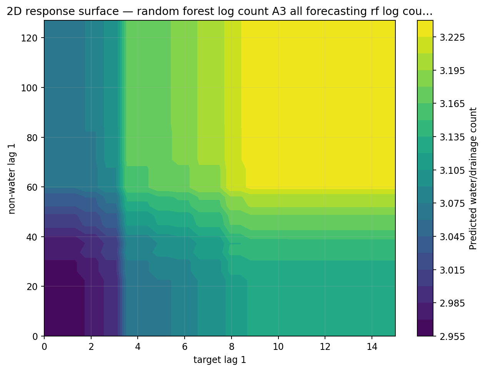

`/home/tim/Documents/ville_ai/indices_BACKUP_before_clean_push/urban_graph_benchmark/outputs/mtl_311_water_v0/baselines/A3_feature_parity_tabular_with_plots/plots/surface_heatmap__random_forest_log_count_A3_all_forecasting_rf_log_count_conservative__target_history_water_drainage_count_lag_1__reporting_history_total_311_count_non_water_drainage_lag_1.png`

## surface 4 2

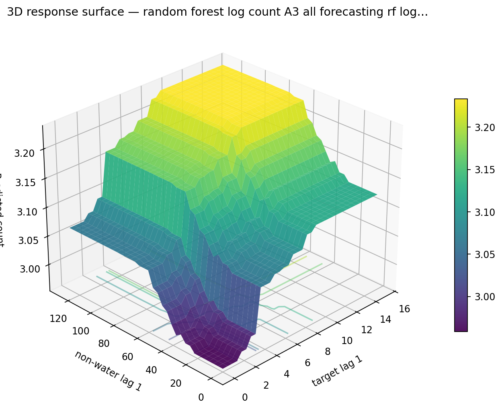

`/home/tim/Documents/ville_ai/indices_BACKUP_before_clean_push/urban_graph_benchmark/outputs/mtl_311_water_v0/baselines/A3_feature_parity_tabular_with_plots/plots/surface_3d__random_forest_log_count_A3_all_forecasting_rf_log_count_conservative__target_history_water_drainage_count_lag_1__reporting_history_total_311_count_non_water_drainage_lag_1.png`
